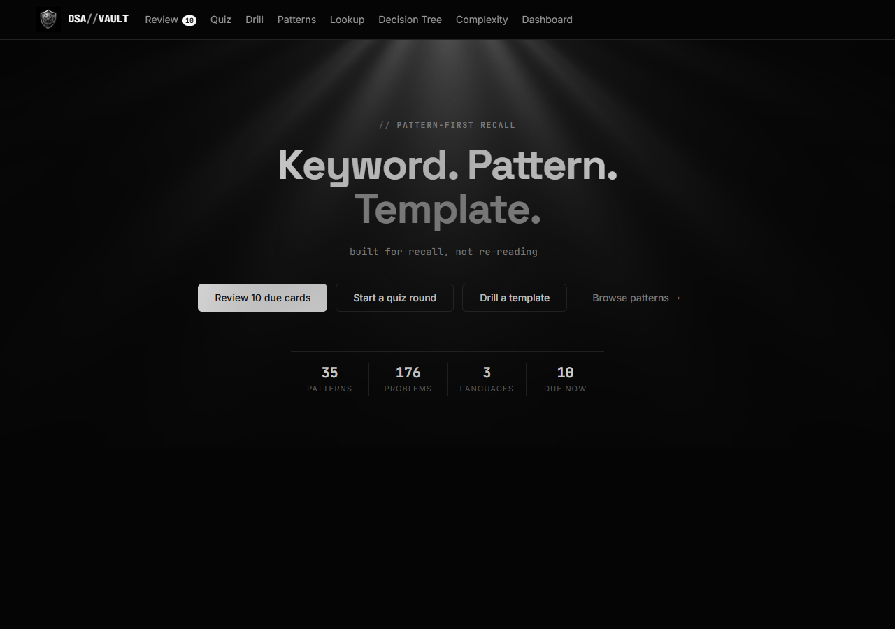
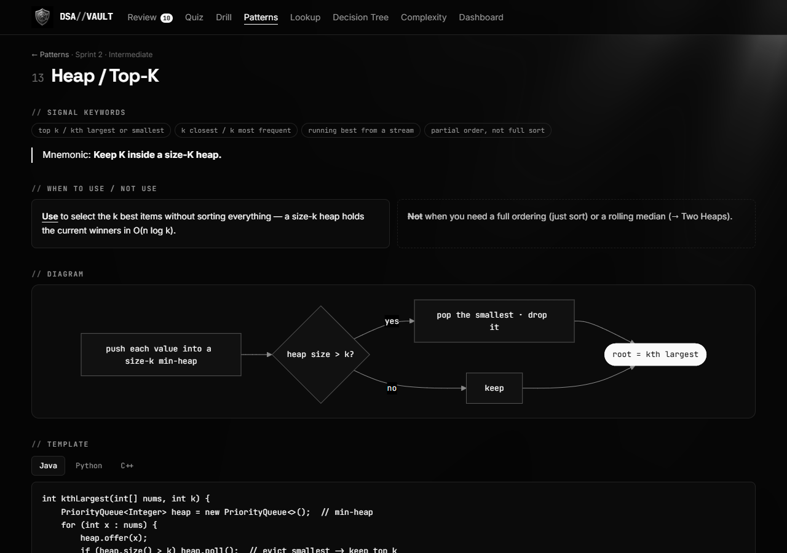

<div align="center">


# DSA Pattern Vault

**Keyword → Pattern → Template.**
Built for recall, not re-reading.

[**⚡ Use it live**](https://ultimate-arsenal.vercel.app) · 35 patterns · 351 spaced-recall cards · 176 curated problems

   



</div>

---

## The idea

Most DSA prep fails the same way: you *read* solutions, nod along, and forget them by the weekend. Reading feels like learning — it isn't. **Retrieval is.**

The Vault flips every surface into a recall exercise. A problem gives off *signals* ("top k…", "shortest path, unweighted…"); signals map to one of 35 *patterns*; each pattern has one canonical *template* you should be able to write from memory. Nothing here reads like a textbook — even opening a pattern page makes you answer a question first.

## What's inside

| Surface | The recall it forces |
|---|---|
| **Review** | 351 cards scheduled by FSRS — signals, template clozes, and re-solve prompts arrive right before you'd forget them |
| **Quiz** | Interleaved rounds: a random cue from any of 35 patterns, 8-way choice, instant *why* |
| **Drill** | Type the missing template lines (they rotate), or **Fix the bug** — one line sabotaged, comments intact, find and repair it |
| **Patterns** | 35 one-pagers behind a recall gate: pick the true signal before the page opens |
| **Decision Tree** | "What's the structure? What's asked?" — click through to the right pattern when the keyword didn't fire |
| **Lookup & Complexity** | Phrase→pattern flashcards and a quizzable Big-O table |

<div align="center"></div>

## How to use it effectively

**The 15-minute daily loop:**

1. **Review** — clear the due cards. Grade honestly: *what you recalled before revealing*, not after. Honest "Again"s are the system working, not you failing.
2. **Quiz** — one 10-question round. The misses are your weak patterns; open their pages and take the gate.
3. **Drill** — one template, fill-in or fix-the-bug. If a pattern showed up weak on the dashboard, drill that one.

**When solving real problems:** read the statement, name the signal out loud, commit to a pattern *before* coding. Stuck picking? Walk the **Decision Tree**. Blanked on a phrase? **Lookup**, then drill that pattern the same day.

**The one rule that makes it work:** never let the app show you an answer you haven't attempted first. Every reveal button is a self-test — treat it that way and FSRS handles the rest (88% retention target, 10 new cards/day).

Progress lives in your browser (localStorage) — pick one device/browser and do your dailies there.

## Run it yourself

```bash
git clone https://github.com/heyitspuru/Ultimate-Arsenal.git
cd Ultimate-Arsenal/app
npm install
npm run dev        # http://localhost:5173
```

All 35 patterns live as plain markdown in [`content/patterns/`](content/patterns) — one source of truth feeding three artifacts:

```
content/*.md ──► app/        React recall app (this site)
             ──► anki/       build_deck.py → FSRS-ready .apkg (same 351 cards)
             ──► site/       build_pdf.py  → one printable revision pack
```

Add a pattern by copying [`content/_TEMPLATE.md`](content/_TEMPLATE.md) — the 8-section format is enforced (≤1 screen, Java ≤25 lines, exactly 5 problems, mnemonic ≤8 words). The app, Anki deck, and PDF pick it up on rebuild.

---
### If you Found this project and repo useful in your DSA prep and revesions, Pls Do give it a star:)

<div align="center">
<sub>Patterns cross-checked against the community 94-sub-pattern sheet — <a href="content/masters/pattern-map.md">coverage map</a>.</sub>
</div>
