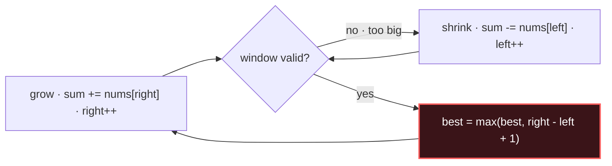

<!--
================================================================================
  PATTERN ONE-PAGER TEMPLATE  —  copy this file to content/patterns/NN-slug.md
================================================================================
  HARD CONSTRAINTS (reject the page if any fail):
    • ≤ 1 screen on desktop  •  ≤ 60 lines of rendered markdown body
    • Java template ≤ 25 lines, 3–5 inline comments MAX
    • Exactly 5 canonical problems, difficulty-tagged, easy → hard
    • Mnemonic ≤ 8 words
    • Every section forces RETRIEVAL, never reads like a textbook
  The 8 sections below are FIXED and must appear IN THIS ORDER.
  The YAML frontmatter is the single source of truth for the Anki builder —
  keep it accurate; build_deck.py parses it into cards.
  This file is filled with Sliding Window as a live style reference + render test.
================================================================================
-->

# Sliding Window

## Signal keywords
<span class="chip">longest/shortest contiguous</span> <span class="chip">substring / subarray</span> <span class="chip">at most K distinct</span> <span class="chip">window size k</span> <span class="chip">max/min sum of run</span>

## When to use / NOT use

<div class="usenot" markdown>
<div class="wbox use" markdown>

**Use** for the *best* contiguous run in a linear structure where a running summary (count, sum, freq map) updates in O(1) as the window moves.

</div>
<div class="wbox avoid" markdown>

**Not** for non-contiguous picks (→ DP/backtracking), or when order can be broken (→ sort / two pointers on sorted data).

</div>
</div>

## Diagram


## Mnemonic
!!! tip "Mnemonic" 
    **Grow right, shrink left, track best.**

## Template
=== "Java"
    ```java
    int slidingWindow(int[] nums, int k) {
        int left = 0, best = 0, sum = 0;
        for (int right = 0; right < nums.length; right++) {
            sum += nums[right];                 // grow window by right edge
            while (windowInvalid(sum, k)) {     // shrink until valid again
                sum -= nums[left];
                left++;
            }
            best = Math.max(best, right - left + 1);
        }
        return best;                            // best valid window length
    }
    ```
=== "Python"
    ```python
    def sliding_window(nums, k):
        left = best = total = 0
        for right, x in enumerate(nums):
            total += x                       # grow
            while window_invalid(total, k):  # shrink
                total -= nums[left]; left += 1
            best = max(best, right - left + 1)
        return best
    ```
=== "C++"
    ```cpp
    int slidingWindow(vector<int>& nums, int k) {
        int left = 0, best = 0, sum = 0;
        for (int right = 0; right < nums.size(); ++right) {
            sum += nums[right];                 // grow
            while (windowInvalid(sum, k)) {     // shrink
                sum -= nums[left++];
            }
            best = max(best, right - left + 1);
        }
        return best;
    }
    ```

## Complexity
**Time O(n)** — each index enters and leaves the window once. **Space O(k)** — the running summary (freq map ≤ k keys); O(1) if a scalar sum.

## Pitfalls

- Shrinking with `if` instead of `while`.
- Forgetting to update the running summary on *both* edges.
- Off-by-one on window length (`right - left + 1`).
- Fixed-size windows don't need the while loop — just pop the element leaving at `right - k`.

## Canonical problems
1. [Maximum Average Subarray I](https://leetcode.com/problems/maximum-average-subarray-i/) <span class="diff-e">Easy</span>
2. [Longest Substring Without Repeating Characters](https://leetcode.com/problems/longest-substring-without-repeating-characters/) <span class="diff-m">Medium</span>
3. [Fruit Into Baskets](https://leetcode.com/problems/fruit-into-baskets/) <span class="diff-m">Medium</span>
4. [Minimum Size Subarray Sum](https://leetcode.com/problems/minimum-size-subarray-sum/) <span class="diff-m">Medium</span>
5. [Minimum Window Substring](https://leetcode.com/problems/minimum-window-substring/) <span class="diff-h">Hard</span>
