# Decision Flowchart

> **How to pick a pattern.** Start at the top, answer each branch, land on a pattern. Use this when the keyword table didn't give an instant hit.

```mermaid
flowchart TD
  Start([New problem]) --> DS{Main structure?}

  DS -->|"Array / String"| ARR{What is asked?}
  ARR -->|"best contiguous run"| SW[Sliding Window]:::hot
  ARR -->|"sorted · pair-sum · palindrome"| TP[Two Pointers]
  ARR -->|"range sums · subarray = K"| PS[Prefix Sum]
  ARR -->|"seen · dup · complement · group"| HS[Hashing]
  ARR -->|"values are 1..n"| CS[Cyclic Sort]
  ARR -->|"next greater · histogram"| MS[Monotonic Stack]
  ARR -->|"sorted OR minimize-the-max"| BS[Binary Search]:::hot

  DS -->|"Linked List"| LL{Which?}
  LL -->|"cycle · middle"| FS[Fast & Slow Pointers]
  LL -->|"reverse · reorder"| LR[LinkedList Reversal]

  DS -->|"Tree"| TR{Traversal?}
  TR -->|"by level · min depth"| TB[Tree BFS]
  TR -->|"paths · subtree · LCA"| TD[Tree DFS]

  DS -->|"Graph / Grid"| GR{Goal?}
  GR -->|"shortest unweighted"| GB[Graph BFS]:::hot
  GR -->|"components · reachability"| GD[Graph DFS]
  GR -->|"dependency order (DAG)"| TS[Topological Sort]
  GR -->|"dynamic connectivity"| UF[Union-Find]

  DS -->|"Strings + prefixes"| TRIE[Trie]

  Start --> OPT{Optimization / counting?}
  OPT -->|"top-k · kth"| HK[Heap / Top-K]
  OPT -->|"streaming median"| TH[Two Heaps]
  OPT -->|"merge k sorted"| KM[K-way Merge]
  OPT -->|"enumerate ALL configs"| BT[Backtracking]
  OPT -->|"local rule = global opt"| GY[Greedy]
  OPT -->|"overlapping subproblems"| DP[Dynamic Programming]:::hot
  OPT -->|"bit tricks · XOR · mask"| BM[Bit Manipulation]

  GR -->|"weighted shortest path"| DIJ[Dijkstra / Bellman-Ford]:::hot
  GR -->|"connect all at min cost"| MSTN[Minimum Spanning Tree]
  GR -->|"SCC · bridges · articulation"| TAR[Tarjan]

  DS -->|"String search / matching"| SM[String Matching - KMP]:::hot

  OPT -->|"range [i,j] from splits"| IDP[Interval DP]
  DS -->|"cache · O(1) get/put design"| LRU[LRU / LFU Design]

  classDef hot fill:#3a1418,stroke:#ff5c5c,color:#ffffff,stroke-width:2px;
```

## Three questions that resolve most ties

1. **Is it contiguous?** Yes → Sliding Window / Prefix Sum. No → DP / Backtracking.
2. **Do I need every solution, or just the best/count?** Every → Backtracking. Best/count → Greedy or DP (DP if choices overlap).
3. **Is there a monotonic predicate** (`feasible(x)` flips once)? Yes → Binary Search on the answer, even when the input isn't "sorted".
