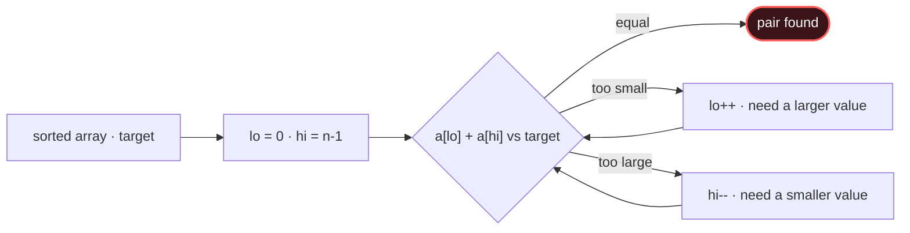

# Two Pointers

## Signal keywords
<span class="chip">sorted array</span> <span class="chip">pair/triplet sum</span> <span class="chip">palindrome</span> <span class="chip">remove/partition in place</span> <span class="chip">meet in the middle</span>

## When to use / NOT use

<div class="usenot" markdown>
<div class="wbox use" markdown>

**Use** on a sorted array (or two sequences) where moving one end predictably raises/lowers a quantity — pair sums, palindromes, in-place partitions.

</div>
<div class="wbox avoid" markdown>

**Not** for unsorted "all pairs" (→ Hashing) or best contiguous run (→ Sliding Window).

</div>
</div>

## Diagram


## Mnemonic
!!! tip "Mnemonic"
    **Two ends squeeze toward the middle.**

## Template
=== "Java"
    ```java
    int[] twoSumSorted(int[] a, int target) {
        int lo = 0, hi = a.length - 1;
        while (lo < hi) {
            int sum = a[lo] + a[hi];
            if (sum == target) return new int[]{lo, hi};
            if (sum < target) lo++;   // need bigger → raise low end
            else hi--;                // need smaller → lower high end
        }
        return new int[]{-1, -1};
    }
    ```
=== "Python"
    ```python
    def two_sum_sorted(a, target):
        lo, hi = 0, len(a) - 1
        while lo < hi:
            s = a[lo] + a[hi]
            if s == target: return (lo, hi)
            if s < target: lo += 1     # need bigger
            else: hi -= 1              # need smaller
        return (-1, -1)
    ```
=== "C++"
    ```cpp
    vector<int> twoSumSorted(vector<int>& a, int target) {
        int lo = 0, hi = a.size() - 1;
        while (lo < hi) {
            int sum = a[lo] + a[hi];
            if (sum == target) return {lo, hi};
            if (sum < target) lo++;   // need bigger
            else hi--;                // need smaller
        }
        return {-1, -1};
    }
    ```

## Complexity
**Time O(n)** to sweep (plus O(n log n) if you must sort first). **Space O(1)** — just the two indices.

## Pitfalls

- Forgetting the array must be *sorted*.
- Using `lo <= hi` when the pair must be distinct.
- Not skipping duplicates in 3Sum.
- Moving the wrong pointer so you overshoot the target.

## Canonical problems
1. [Valid Palindrome](https://leetcode.com/problems/valid-palindrome/) <span class="diff-e">Easy</span>
2. [Two Sum II - Input Array Is Sorted](https://leetcode.com/problems/two-sum-ii-input-array-is-sorted/) <span class="diff-m">Medium</span>
3. [Container With Most Water](https://leetcode.com/problems/container-with-most-water/) <span class="diff-m">Medium</span>
4. [3Sum](https://leetcode.com/problems/3sum/) <span class="diff-m">Medium</span>
5. [Trapping Rain Water](https://leetcode.com/problems/trapping-rain-water/) <span class="diff-h">Hard</span>
