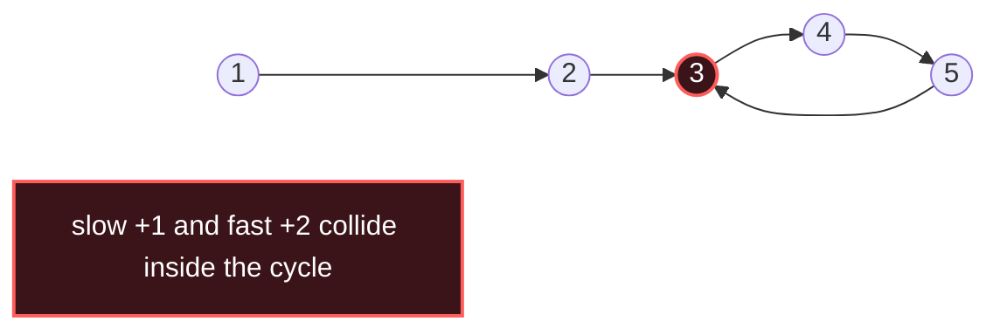

# Fast & Slow Pointers

## Signal keywords
<span class="chip">linked list cycle</span> <span class="chip">find middle</span> <span class="chip">nth from end</span> <span class="chip">cycle entry</span> <span class="chip">happy number</span>

## When to use / NOT use

<div class="usenot" markdown>
<div class="wbox use" markdown>

**Use** on a linked list or implicit functional graph (each node has one "next") to detect a cycle, find its entry, or locate the middle — all in O(1) space.

</div>
<div class="wbox avoid" markdown>

**Not** when you need random access or index arithmetic (→ Two Pointers on arrays).

</div>
</div>

## Diagram


## Mnemonic
!!! tip "Mnemonic"
    **Tortoise and hare meet in cycles.**

## Template
=== "Java"
    ```java
    boolean hasCycle(ListNode head) {
        ListNode slow = head, fast = head;
        while (fast != null && fast.next != null) {
            slow = slow.next;          // 1 step
            fast = fast.next.next;     // 2 steps
            if (slow == fast) return true;  // met → cycle exists
        }
        return false;                  // fast fell off → no cycle
    }
    ```
=== "Python"
    ```python
    def has_cycle(head):
        slow = fast = head
        while fast and fast.next:
            slow = slow.next          # 1 step
            fast = fast.next.next     # 2 steps
            if slow is fast: return True
        return False
    ```
=== "C++"
    ```cpp
    bool hasCycle(ListNode* head) {
        ListNode *slow = head, *fast = head;
        while (fast && fast->next) {
            slow = slow->next;         // 1 step
            fast = fast->next->next;   // 2 steps
            if (slow == fast) return true;
        }
        return false;
    }
    ```

## Complexity
**Time O(n)** — fast laps slow within one cycle length. **Space O(1)** — two pointers, no hash set.

## Pitfalls

- Null-checking `fast.next` before `fast.next.next`.
- To find the cycle *start*, reset one pointer to head and advance both by 1.
- Middle definition (upper vs lower) depends on the `fast` start.

## Canonical problems
1. [Middle of the Linked List](https://leetcode.com/problems/middle-of-the-linked-list/) <span class="diff-e">Easy</span>
2. [Linked List Cycle](https://leetcode.com/problems/linked-list-cycle/) <span class="diff-e">Easy</span>
3. [Happy Number](https://leetcode.com/problems/happy-number/) <span class="diff-e">Easy</span>
4. [Linked List Cycle II](https://leetcode.com/problems/linked-list-cycle-ii/) <span class="diff-m">Medium</span>
5. [Find the Duplicate Number](https://leetcode.com/problems/find-the-duplicate-number/) <span class="diff-m">Medium</span>
