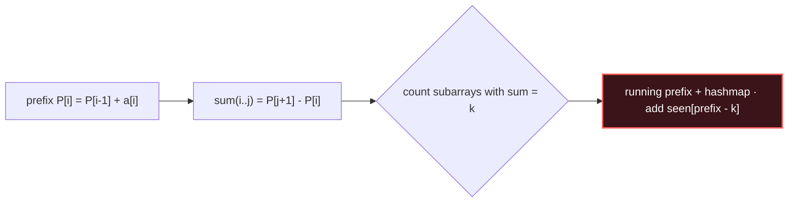

# Prefix Sum

## Signal keywords
<span class="chip">range sum query</span> <span class="chip">subarray sum = K</span> <span class="chip">count subarrays</span> <span class="chip">array fixed, many queries</span> <span class="chip">2D region sum</span>

## When to use / NOT use

<div class="usenot" markdown>
<div class="wbox use" markdown>

**Use** when you need sums (or counts) over many subarrays/ranges of a *fixed* array — a hashmap of prefixes turns "sum == K" into O(n).

</div>
<div class="wbox avoid" markdown>

**Not** when values change often (→ Fenwick/segment tree) or you need max/min of a range (→ sparse table / monotonic).

</div>
</div>

## Diagram


## Mnemonic
!!! tip "Mnemonic"
    **Precompute totals; subtract two prefixes.**

## Template
=== "Java"
    ```java
    int subarraySum(int[] nums, int k) {
        Map<Integer,Integer> seen = new HashMap<>();
        seen.put(0, 1);                 // empty prefix seeds the map
        int sum = 0, count = 0;
        for (int x : nums) {
            sum += x;                   // running prefix
            count += seen.getOrDefault(sum - k, 0);  // prefixes that close a window
            seen.merge(sum, 1, Integer::sum);
        }
        return count;
    }
    ```
=== "Python"
    ```python
    def subarray_sum(nums, k):
        seen = {0: 1}                   # empty prefix
        total = count = 0
        for x in nums:
            total += x
            count += seen.get(total - k, 0)
            seen[total] = seen.get(total, 0) + 1
        return count
    ```
=== "C++"
    ```cpp
    int subarraySum(vector<int>& nums, int k) {
        unordered_map<int,int> seen{{0, 1}};
        int sum = 0, count = 0;
        for (int x : nums) {
            sum += x;
            count += seen.count(sum - k) ? seen[sum - k] : 0;
            seen[sum]++;
        }
        return count;
    }
    ```

## Complexity
**Time O(n)** single pass. **Space O(n)** for the prefix map (O(1) if only a plain prefix array with direct range queries).

## Pitfalls

- Forgetting to seed `seen[0] = 1`.
- Off-by-one between prefix index and array index.
- Integer overflow on large arrays (use `long`).
- Using a prefix array when values mutate.

## Canonical problems
1. [Running Sum of 1d Array](https://leetcode.com/problems/running-sum-of-1d-array/) <span class="diff-e">Easy</span>
2. [Range Sum Query - Immutable](https://leetcode.com/problems/range-sum-query-immutable/) <span class="diff-e">Easy</span>
3. [Subarray Sum Equals K](https://leetcode.com/problems/subarray-sum-equals-k/) <span class="diff-m">Medium</span>
4. [Product of Array Except Self](https://leetcode.com/problems/product-of-array-except-self/) <span class="diff-m">Medium</span>
5. [Contiguous Array](https://leetcode.com/problems/contiguous-array/) <span class="diff-m">Medium</span>
