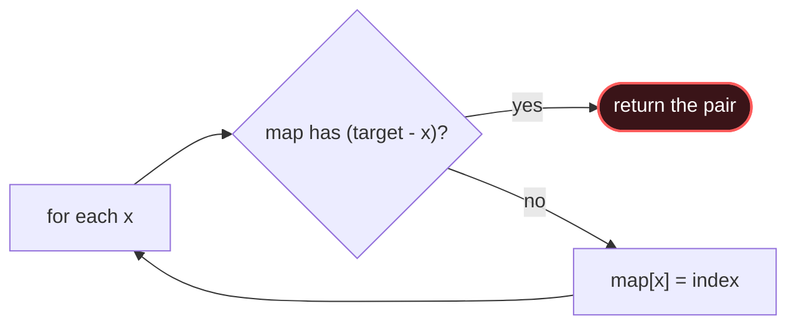

# Hashing

## Signal keywords
<span class="chip">seen before</span> <span class="chip">duplicates</span> <span class="chip">complement / two-sum</span> <span class="chip">group by key</span> <span class="chip">frequency count</span>

## When to use / NOT use

<div class="usenot" markdown>
<div class="wbox use" markdown>

**Use** when you need O(1) membership, frequency, complement, or grouping and order doesn't matter. A `HashMap`/`HashSet` collapses an O(n²) scan to O(n).

</div>
<div class="wbox avoid" markdown>

**Not** when you need sorted order or range queries (→ TreeMap / sorting) — hashing loses ordering.

</div>
</div>

## Diagram


## Mnemonic
!!! tip "Mnemonic"
    **Trade memory for O(1) lookups.**

## Template
=== "Java"
    ```java
    int[] twoSum(int[] nums, int target) {
        Map<Integer,Integer> idx = new HashMap<>();
        for (int i = 0; i < nums.length; i++) {
            int need = target - nums[i];
            if (idx.containsKey(need))          // complement already seen
                return new int[]{idx.get(need), i};
            idx.put(nums[i], i);                // record value → index
        }
        return new int[]{-1, -1};
    }
    ```
=== "Python"
    ```python
    def two_sum(nums, target):
        idx = {}
        for i, x in enumerate(nums):
            need = target - x
            if need in idx:                  # complement seen
                return [idx[need], i]
            idx[x] = i
        return [-1, -1]
    ```
=== "C++"
    ```cpp
    vector<int> twoSum(vector<int>& nums, int target) {
        unordered_map<int,int> idx;
        for (int i = 0; i < nums.size(); ++i) {
            int need = target - nums[i];
            if (idx.count(need)) return {idx[need], i};
            idx[nums[i]] = i;
        }
        return {-1, -1};
    }
    ```

## Complexity
**Time O(n)** average (hash ops O(1) amortized). **Space O(n)** for the map/set.

## Pitfalls

- Inserting *before* checking the complement (matches an element with itself).
- Relying on iteration order.
- Hashing mutable objects.
- Worst-case O(n) buckets on adversarial keys.

## Canonical problems
1. [Two Sum](https://leetcode.com/problems/two-sum/) <span class="diff-e">Easy</span>
2. [Contains Duplicate](https://leetcode.com/problems/contains-duplicate/) <span class="diff-e">Easy</span>
3. [Valid Anagram](https://leetcode.com/problems/valid-anagram/) <span class="diff-e">Easy</span>
4. [Group Anagrams](https://leetcode.com/problems/group-anagrams/) <span class="diff-m">Medium</span>
5. [Longest Consecutive Sequence](https://leetcode.com/problems/longest-consecutive-sequence/) <span class="diff-m">Medium</span>
