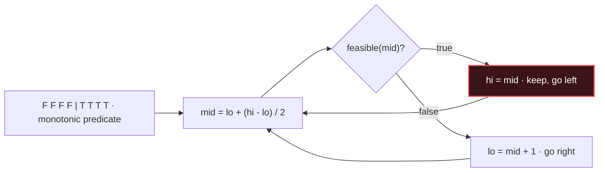

# Binary Search (+ on answer)

## Signal keywords
<span class="chip">sorted / rotated</span> <span class="chip">minimize the maximum</span> <span class="chip">smallest x such that…</span> <span class="chip">monotonic predicate</span> <span class="chip">kth / threshold</span>

## When to use / NOT use

<div class="usenot" markdown>
<div class="wbox use" markdown>

**Use** on a sorted array, or on an *answer space* where `feasible(x)` flips false→true monotonically ("binary search on the answer").

</div>
<div class="wbox avoid" markdown>

**Not** when no monotone predicate exists — you can't bisect what isn't ordered.

</div>
</div>

## Diagram


## Mnemonic
!!! tip "Mnemonic"
    **Halve the space; keep feasible side.**

## Template
=== "Java"
    ```java
    int firstTrue(int lo, int hi) {         // search answer space [lo, hi]
        while (lo < hi) {
            int mid = lo + (hi - lo) / 2;   // avoid overflow
            if (feasible(mid)) hi = mid;    // works → keep it, search left
            else lo = mid + 1;              // fails → search right
        }
        return lo;                          // smallest feasible value
    }
    ```
=== "Python"
    ```python
    def first_true(lo, hi):                 # answer space [lo, hi]
        while lo < hi:
            mid = (lo + hi) // 2
            if feasible(mid): hi = mid      # keep, go left
            else: lo = mid + 1             # go right
        return lo
    ```
=== "C++"
    ```cpp
    int firstTrue(int lo, int hi) {         // answer space [lo, hi]
        while (lo < hi) {
            int mid = lo + (hi - lo) / 2;   // avoid overflow
            if (feasible(mid)) hi = mid;    // keep, go left
            else lo = mid + 1;             // go right
        }
        return lo;
    }
    ```

## Complexity
**Time O(log n)** iterations × cost of `feasible`. **Space O(1)**.

## Pitfalls

- `(lo+hi)/2` overflow (use `lo + (hi-lo)/2`).
- `lo = mid` causing an infinite loop — pair `hi = mid` with `lo = mid + 1`.
- Confusing *first-true* vs *last-true* boundary.
- Wrong initial `hi` (must be inclusive of a valid answer).

## Canonical problems
1. [Binary Search](https://leetcode.com/problems/binary-search/) <span class="diff-e">Easy</span>
2. [First Bad Version](https://leetcode.com/problems/first-bad-version/) <span class="diff-e">Easy</span>
3. [Find Minimum in Rotated Sorted Array](https://leetcode.com/problems/find-minimum-in-rotated-sorted-array/) <span class="diff-m">Medium</span>
4. [Koko Eating Bananas](https://leetcode.com/problems/koko-eating-bananas/) <span class="diff-m">Medium</span>
5. [Split Array Largest Sum](https://leetcode.com/problems/split-array-largest-sum/) <span class="diff-h">Hard</span>
