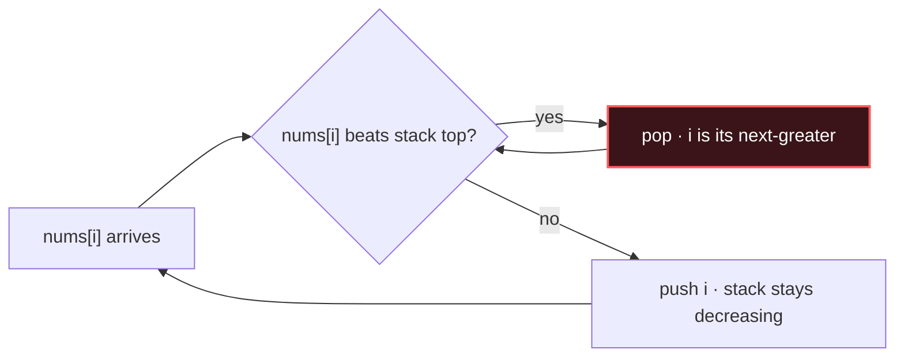

# Monotonic Stack

## Signal keywords
<span class="chip">next greater/smaller</span> <span class="chip">nearest larger</span> <span class="chip">histogram</span> <span class="chip">span / temperatures</span> <span class="chip">pop while …</span>

## When to use / NOT use

<div class="usenot" markdown>
<div class="wbox use" markdown>

**Use** to find, for every element, the nearest greater/smaller element (or the range it dominates) in one linear pass — keep a stack whose values stay monotonic.

</div>
<div class="wbox avoid" markdown>

**Not** when you need a global sort or random access; the stack only knows its current run.

</div>
</div>

## Diagram


## Mnemonic
!!! tip "Mnemonic"
    **Pop losers; stack stays sorted.**

## Template
=== "Java"
    ```java
    int[] nextGreater(int[] nums) {
        int n = nums.length;
        int[] res = new int[n];
        Arrays.fill(res, -1);
        Deque<Integer> st = new ArrayDeque<>();   // indices, values decreasing
        for (int i = 0; i < n; i++) {
            while (!st.isEmpty() && nums[i] > nums[st.peek()])
                res[st.pop()] = nums[i];          // i answers the popped index
            st.push(i);
        }
        return res;                               // leftovers stay -1
    }
    ```
=== "Python"
    ```python
    def next_greater(nums):
        res = [-1] * len(nums)
        st = []                              # indices, decreasing values
        for i, x in enumerate(nums):
            while st and x > nums[st[-1]]:
                res[st.pop()] = x            # i answers popped index
            st.append(i)
        return res
    ```
=== "C++"
    ```cpp
    vector<int> nextGreater(vector<int>& nums) {
        int n = nums.size();
        vector<int> res(n, -1);
        stack<int> st;                       // indices, decreasing values
        for (int i = 0; i < n; ++i) {
            while (!st.empty() && nums[i] > nums[st.top()]) {
                res[st.top()] = nums[i]; st.pop();
            }
            st.push(i);
        }
        return res;
    }
    ```

## Complexity
**Time O(n)** — each index is pushed and popped at most once. **Space O(n)** for the stack.

## Pitfalls

- Storing values when you need indices (or vice versa).
- Wrong strictness (`>` vs `>=`) with duplicates.
- Picking the wrong monotonic direction (increasing vs decreasing) for "greater" vs "smaller".
- Forgetting unresolved elements keep the default.

## Canonical problems
1. [Next Greater Element I](https://leetcode.com/problems/next-greater-element-i/) <span class="diff-e">Easy</span>
2. [Daily Temperatures](https://leetcode.com/problems/daily-temperatures/) <span class="diff-m">Medium</span>
3. [Online Stock Span](https://leetcode.com/problems/online-stock-span/) <span class="diff-m">Medium</span>
4. [Sum of Subarray Minimums](https://leetcode.com/problems/sum-of-subarray-minimums/) <span class="diff-m">Medium</span>
5. [Largest Rectangle in Histogram](https://leetcode.com/problems/largest-rectangle-in-histogram/) <span class="diff-h">Hard</span>
