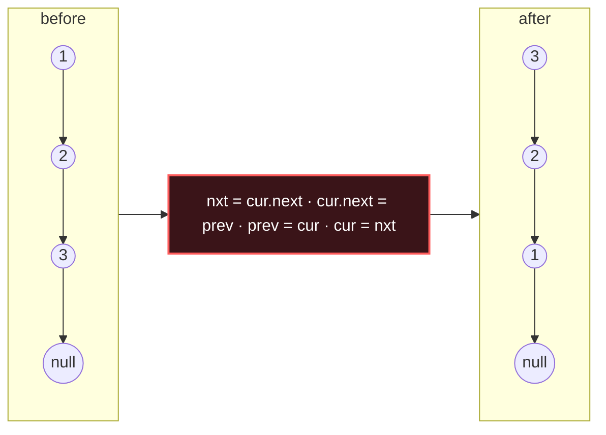

# LinkedList Reversal

## Signal keywords
<span class="chip">reverse a list</span> <span class="chip">reverse sublist</span> <span class="chip">k-group</span> <span class="chip">swap pairs</span> <span class="chip">reorder / palindrome</span>

## When to use / NOT use

<div class="usenot" markdown>
<div class="wbox use" markdown>

**Use** to reverse all or part of a singly linked list in place by flipping `next` pointers — O(1) extra space.

</div>
<div class="wbox avoid" markdown>

**Not** when you need repeated backward traversal or random access (→ array / deque).

</div>
</div>

## Diagram


## Mnemonic
!!! tip "Mnemonic"
    **Rewire next backward, one hop each.**

## Template
=== "Java"
    ```java
    ListNode reverse(ListNode head) {
        ListNode prev = null, cur = head;
        while (cur != null) {
            ListNode next = cur.next;  // save the rest first
            cur.next = prev;           // flip pointer backward
            prev = cur;                // advance prev
            cur = next;                // advance cur
        }
        return prev;                   // prev is the new head
    }
    ```
=== "Python"
    ```python
    def reverse(head):
        prev, cur = None, head
        while cur:
            nxt = cur.next        # save rest
            cur.next = prev       # flip
            prev, cur = cur, nxt  # advance both
        return prev
    ```
=== "C++"
    ```cpp
    ListNode* reverse(ListNode* head) {
        ListNode *prev = nullptr, *cur = head;
        while (cur) {
            ListNode* next = cur->next;  // save rest
            cur->next = prev;            // flip
            prev = cur; cur = next;      // advance
        }
        return prev;
    }
    ```

## Complexity
**Time O(n)** single pass. **Space O(1)** — three pointers, no copy.

## Pitfalls

- Not saving `cur.next` before overwriting it (loses the rest).
- Returning `cur` (null) instead of `prev`.
- Sublist reversal needs a dummy head and re-linking both boundaries.
- Off-by-one when counting to position `m`/`n`.

## Canonical problems
1. [Reverse Linked List](https://leetcode.com/problems/reverse-linked-list/) <span class="diff-e">Easy</span>
2. [Swap Nodes in Pairs](https://leetcode.com/problems/swap-nodes-in-pairs/) <span class="diff-m">Medium</span>
3. [Reverse Linked List II](https://leetcode.com/problems/reverse-linked-list-ii/) <span class="diff-m">Medium</span>
4. [Rotate List](https://leetcode.com/problems/rotate-list/) <span class="diff-m">Medium</span>
5. [Reverse Nodes in k-Group](https://leetcode.com/problems/reverse-nodes-in-k-group/) <span class="diff-h">Hard</span>
