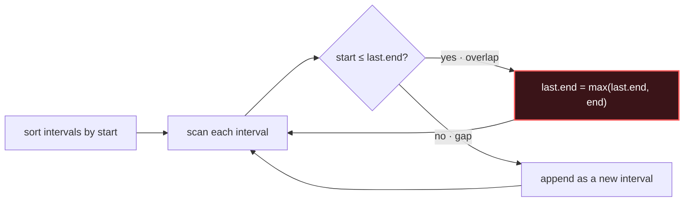

# Merge Intervals

## Signal keywords
<span class="chip">overlapping ranges</span> <span class="chip">merge intervals</span> <span class="chip">insert interval</span> <span class="chip">meeting rooms</span> <span class="chip">conflicts / free time</span>

## When to use / NOT use

<div class="usenot" markdown>
<div class="wbox use" markdown>

**Use** when the input is a set of intervals and the answer depends on overlaps — sort by start, then sweep left to right merging or counting.

</div>
<div class="wbox avoid" markdown>

**Not** when data has no natural ordering to sort on, or overlap isn't the question.

</div>
</div>

## Diagram


## Mnemonic
!!! tip "Mnemonic"
    **Sort by start; extend or append.**

## Template
=== "Java"
    ```java
    int[][] merge(int[][] iv) {
        Arrays.sort(iv, (a, b) -> Integer.compare(a[0], b[0]));  // by start
        List<int[]> out = new ArrayList<>();
        for (int[] cur : iv) {
            int n = out.size();
            if (n > 0 && cur[0] <= out.get(n - 1)[1])            // overlap?
                out.get(n - 1)[1] = Math.max(out.get(n - 1)[1], cur[1]);
            else
                out.add(cur);                                    // gap -> new
        }
        return out.toArray(new int[0][]);
    }
    ```
=== "Python"
    ```python
    def merge(iv):
        iv.sort(key=lambda x: x[0])        # by start
        out = []
        for s, e in iv:
            if out and s <= out[-1][1]:    # overlap
                out[-1][1] = max(out[-1][1], e)
            else:
                out.append([s, e])         # gap
        return out
    ```
=== "C++"
    ```cpp
    vector<vector<int>> merge(vector<vector<int>>& iv) {
        sort(iv.begin(), iv.end());        // by start
        vector<vector<int>> out;
        for (auto& cur : iv) {
            if (!out.empty() && cur[0] <= out.back()[1])
                out.back()[1] = max(out.back()[1], cur[1]);
            else out.push_back(cur);
        }
        return out;
    }
    ```

## Complexity
**Time O(n log n)** dominated by the sort. **Space O(n)** for the output (O(log n) if sorting in place and counting only).

## Pitfalls

- Forgetting to sort first.
- Comparator overflow (`a[0]-b[0]` on large ints — use `Integer.compare`).
- Touching intervals `[1,2],[2,3]` — decide `<=` vs `<`.
- Extending to `max(last.end, cur.end)`, not just `cur.end`.

## Canonical problems
1. [Meeting Rooms](https://leetcode.com/problems/meeting-rooms/) <span class="diff-e">Easy</span>
2. [Merge Intervals](https://leetcode.com/problems/merge-intervals/) <span class="diff-m">Medium</span>
3. [Insert Interval](https://leetcode.com/problems/insert-interval/) <span class="diff-m">Medium</span>
4. [Non-overlapping Intervals](https://leetcode.com/problems/non-overlapping-intervals/) <span class="diff-m">Medium</span>
5. [Meeting Rooms II](https://leetcode.com/problems/meeting-rooms-ii/) <span class="diff-m">Medium</span>
