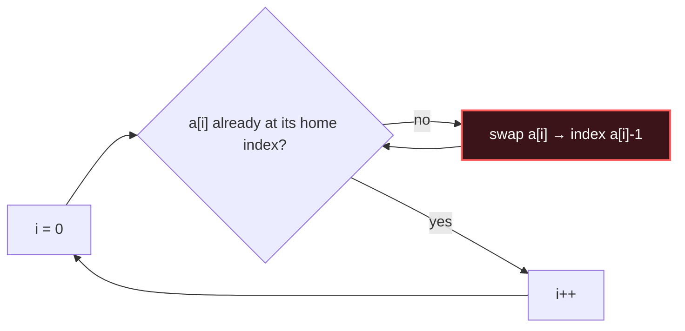

# Cyclic Sort

## Signal keywords
<span class="chip">values in 1..n</span> <span class="chip">missing number</span> <span class="chip">duplicate number</span> <span class="chip">first missing positive</span> <span class="chip">range known</span>

## When to use / NOT use

<div class="usenot" markdown>
<div class="wbox use" markdown>

**Use** when an array of length n holds numbers from a contiguous range (`1..n` or `0..n-1`): place each value at its home index, then a scan finds what's missing or duplicated — O(n) time, O(1) space.

</div>
<div class="wbox avoid" markdown>

**Not** for arbitrary or sparse value ranges.

</div>
</div>

## Diagram


## Mnemonic
!!! tip "Mnemonic"
    **Send each number to its index.**

## Template
=== "Java"
    ```java
    void cyclicSort(int[] a) {
        int i = 0;
        while (i < a.length) {
            int home = a[i] - 1;              // value v belongs at index v-1
            if (a[i] != a[home]) {            // not home AND not a dup there
                int t = a[i]; a[i] = a[home]; a[home] = t;  // swap it home
            } else {
                i++;                          // already placed -> advance
            }
        }
    }
    ```
=== "Python"
    ```python
    def cyclic_sort(a):
        i = 0
        while i < len(a):
            home = a[i] - 1               # v belongs at v-1
            if a[i] != a[home]:           # guard against dup loop
                a[i], a[home] = a[home], a[i]
            else:
                i += 1
    ```
=== "C++"
    ```cpp
    void cyclicSort(vector<int>& a) {
        int i = 0;
        while (i < a.size()) {
            int home = a[i] - 1;          // v belongs at v-1
            if (a[i] != a[home]) swap(a[i], a[home]);
            else i++;
        }
    }
    ```

## Complexity
**Time O(n)** — each swap puts one value home permanently. **Space O(1)** in place.

## Pitfalls

- Comparing to index `i` instead of `a[home]` (duplicates cause an infinite loop — the `a[i] != a[home]` guard is essential).
- Base offset (`0..n-1` vs `1..n`).
- Values outside range must be ignored, not indexed.

## Canonical problems
1. [Missing Number](https://leetcode.com/problems/missing-number/) <span class="diff-e">Easy</span>
2. [Set Mismatch](https://leetcode.com/problems/set-mismatch/) <span class="diff-e">Easy</span>
3. [Find All Numbers Disappeared in an Array](https://leetcode.com/problems/find-all-numbers-disappeared-in-an-array/) <span class="diff-e">Easy</span>
4. [Find the Duplicate Number](https://leetcode.com/problems/find-the-duplicate-number/) <span class="diff-m">Medium</span>
5. [First Missing Positive](https://leetcode.com/problems/first-missing-positive/) <span class="diff-h">Hard</span>
