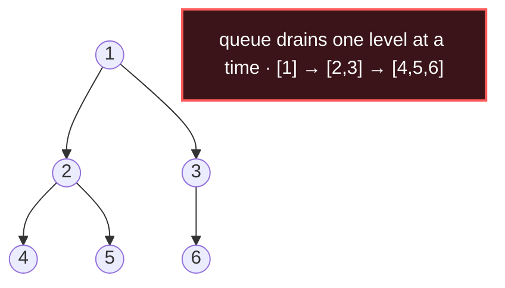

# Tree BFS

## Signal keywords
<span class="chip">level order</span> <span class="chip">by level</span> <span class="chip">minimum depth</span> <span class="chip">right side view</span> <span class="chip">zigzag / connect</span>

## When to use / NOT use

<div class="usenot" markdown>
<div class="wbox use" markdown>

**Use** to process a tree level by level — anything that groups nodes by depth, or needs the shallowest result (minimum depth, first level to satisfy X).

</div>
<div class="wbox avoid" markdown>

**Not** for root-to-leaf paths or subtree aggregation (→ Tree DFS).

</div>
</div>

## Diagram


## Mnemonic
!!! tip "Mnemonic"
    **Queue a level; drain it fully.**

## Template
=== "Java"
    ```java
    List<List<Integer>> levelOrder(TreeNode root) {
        List<List<Integer>> res = new ArrayList<>();
        Queue<TreeNode> q = new LinkedList<>();
        if (root != null) q.add(root);
        while (!q.isEmpty()) {
            int n = q.size();                 // freeze this level's width
            List<Integer> level = new ArrayList<>();
            for (int i = 0; i < n; i++) {
                TreeNode node = q.poll();
                level.add(node.val);
                if (node.left != null)  q.add(node.left);
                if (node.right != null) q.add(node.right);
            }
            res.add(level);
        }
        return res;
    }
    ```
=== "Python"
    ```python
    from collections import deque
    def level_order(root):
        res, q = [], deque([root] if root else [])
        while q:
            level = []
            for _ in range(len(q)):        # freeze width
                node = q.popleft()
                level.append(node.val)
                if node.left:  q.append(node.left)
                if node.right: q.append(node.right)
            res.append(level)
        return res
    ```
=== "C++"
    ```cpp
    vector<vector<int>> levelOrder(TreeNode* root) {
        vector<vector<int>> res; queue<TreeNode*> q;
        if (root) q.push(root);
        while (!q.empty()) {
            int n = q.size(); vector<int> level;
            for (int i = 0; i < n; i++) {
                TreeNode* node = q.front(); q.pop();
                level.push_back(node->val);
                if (node->left)  q.push(node->left);
                if (node->right) q.push(node->right);
            }
            res.push_back(level);
        }
        return res;
    }
    ```

## Complexity
**Time O(n)** — each node enqueued/dequeued once. **Space O(w)** — the widest level.

## Pitfalls

- Not snapshotting `q.size()` before the inner loop (mixes levels).
- Enqueuing null children.
- Forgetting the empty-root guard.
- Reaching for DFS when the question is inherently level-based.

## Canonical problems
1. [Average of Levels in Binary Tree](https://leetcode.com/problems/average-of-levels-in-binary-tree/) <span class="diff-e">Easy</span>
2. [Minimum Depth of Binary Tree](https://leetcode.com/problems/minimum-depth-of-binary-tree/) <span class="diff-e">Easy</span>
3. [Binary Tree Level Order Traversal](https://leetcode.com/problems/binary-tree-level-order-traversal/) <span class="diff-m">Medium</span>
4. [Binary Tree Right Side View](https://leetcode.com/problems/binary-tree-right-side-view/) <span class="diff-m">Medium</span>
5. [Binary Tree Zigzag Level Order Traversal](https://leetcode.com/problems/binary-tree-zigzag-level-order-traversal/) <span class="diff-m">Medium</span>
