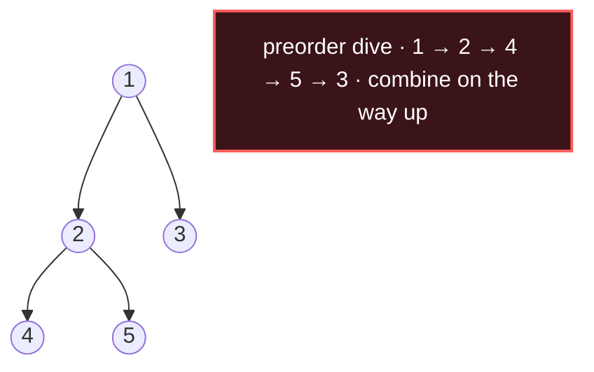

# Tree DFS

## Signal keywords
<span class="chip">root-to-leaf path</span> <span class="chip">path sum</span> <span class="chip">height / diameter</span> <span class="chip">subtree property</span> <span class="chip">lowest common ancestor</span>

## When to use / NOT use

<div class="usenot" markdown>
<div class="wbox use" markdown>

**Use** to explore paths or fold subtree values — recurse to children, then combine their results at each node. Ideal for path sums, height, diameter, LCA.

</div>
<div class="wbox avoid" markdown>

**Not** for shortest unweighted depth or per-level grouping (→ Tree BFS).

</div>
</div>

## Diagram


## Mnemonic
!!! tip "Mnemonic"
    **Recurse down; combine coming back up.**

## Template
=== "Java"
    ```java
    boolean hasPathSum(TreeNode node, int target) {
        if (node == null) return false;
        target -= node.val;                        // consume this node
        if (node.left == null && node.right == null)
            return target == 0;                    // leaf: exact hit?
        return hasPathSum(node.left, target)       // try left subtree
            || hasPathSum(node.right, target);     // or right subtree
    }
    ```
=== "Python"
    ```python
    def has_path_sum(node, target):
        if not node: return False
        target -= node.val                 # consume node
        if not node.left and not node.right:
            return target == 0             # leaf hit?
        return (has_path_sum(node.left, target)
                or has_path_sum(node.right, target))
    ```
=== "C++"
    ```cpp
    bool hasPathSum(TreeNode* node, int target) {
        if (!node) return false;
        target -= node->val;               // consume node
        if (!node->left && !node->right)
            return target == 0;            // leaf hit?
        return hasPathSum(node->left, target)
            || hasPathSum(node->right, target);
    }
    ```

## Complexity
**Time O(n)** — visit each node once. **Space O(h)** — recursion stack, `h` = tree height (O(n) if skewed).

## Pitfalls

- Confusing "null" with "leaf" (a leaf has both children null).
- Missing the base case.
- Sharing mutable path state across branches without undoing it (backtrack).
- Stack overflow on degenerate skewed trees.

## Canonical problems
1. [Maximum Depth of Binary Tree](https://leetcode.com/problems/maximum-depth-of-binary-tree/) <span class="diff-e">Easy</span>
2. [Path Sum](https://leetcode.com/problems/path-sum/) <span class="diff-e">Easy</span>
3. [Diameter of Binary Tree](https://leetcode.com/problems/diameter-of-binary-tree/) <span class="diff-e">Easy</span>
4. [Lowest Common Ancestor of a Binary Tree](https://leetcode.com/problems/lowest-common-ancestor-of-a-binary-tree/) <span class="diff-m">Medium</span>
5. [Binary Tree Maximum Path Sum](https://leetcode.com/problems/binary-tree-maximum-path-sum/) <span class="diff-h">Hard</span>
