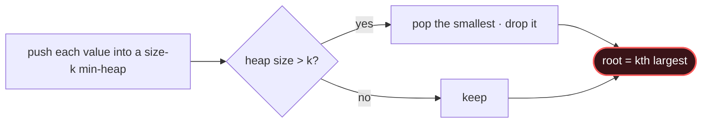

# Heap / Top-K

## Signal keywords
<span class="chip">top k</span> <span class="chip">kth largest/smallest</span> <span class="chip">k closest</span> <span class="chip">k most frequent</span> <span class="chip">running best</span>

## When to use / NOT use

<div class="usenot" markdown>
<div class="wbox use" markdown>

**Use** to select the k best items without sorting everything — a size-k heap holds the current winners in O(n log k).

</div>
<div class="wbox avoid" markdown>

**Not** when you need a full ordering (just sort) or a rolling median (→ Two Heaps).

</div>
</div>

## Diagram


## Mnemonic
!!! tip "Mnemonic"
    **Keep K inside a size-K heap.**

## Template
=== "Java"
    ```java
    int kthLargest(int[] nums, int k) {
        PriorityQueue<Integer> heap = new PriorityQueue<>();  // min-heap
        for (int x : nums) {
            heap.offer(x);
            if (heap.size() > k) heap.poll();  // evict smallest -> keep top k
        }
        return heap.peek();                    // root = kth largest
    }
    ```
=== "Python"
    ```python
    import heapq
    def kth_largest(nums, k):
        heap = []                          # min-heap
        for x in nums:
            heapq.heappush(heap, x)
            if len(heap) > k:
                heapq.heappop(heap)        # drop smallest
        return heap[0]                     # kth largest
    ```
=== "C++"
    ```cpp
    int kthLargest(vector<int>& nums, int k) {
        priority_queue<int, vector<int>, greater<int>> heap;  // min-heap
        for (int x : nums) {
            heap.push(x);
            if (heap.size() > k) heap.pop();  // drop smallest
        }
        return heap.top();
    }
    ```

## Complexity
**Time O(n log k)** — n pushes, each O(log k). **Space O(k)** for the heap.

## Pitfalls

- Using a full-size heap (that's O(n log n)).
- Wrong polarity — a *min*-heap keeps the k *largest*.
- Forgetting to evict once size exceeds k.
- Unstable ties when a comparator ignores a tiebreak.

## Canonical problems
1. [Kth Largest Element in a Stream](https://leetcode.com/problems/kth-largest-element-in-a-stream/) <span class="diff-e">Easy</span>
2. [Last Stone Weight](https://leetcode.com/problems/last-stone-weight/) <span class="diff-e">Easy</span>
3. [K Closest Points to Origin](https://leetcode.com/problems/k-closest-points-to-origin/) <span class="diff-m">Medium</span>
4. [Top K Frequent Elements](https://leetcode.com/problems/top-k-frequent-elements/) <span class="diff-m">Medium</span>
5. [Kth Largest Element in an Array](https://leetcode.com/problems/kth-largest-element-in-an-array/) <span class="diff-m">Medium</span>
