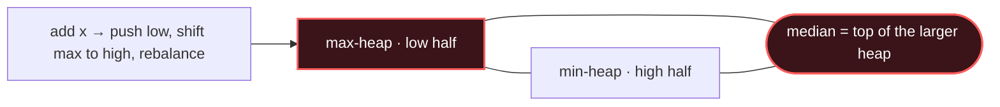

# Two Heaps

## Signal keywords
<span class="chip">median of a stream</span> <span class="chip">balance two halves</span> <span class="chip">sliding window median</span> <span class="chip">two criteria</span> <span class="chip">running middle</span>

## When to use / NOT use

<div class="usenot" markdown>
<div class="wbox use" markdown>

**Use** when you must repeatedly read the middle (or a balance point) of a growing set — a max-heap of the low half and a min-heap of the high half give O(1) median, O(log n) inserts.

</div>
<div class="wbox avoid" markdown>

**Not** when a single heap suffices (→ Heap / Top-K).

</div>
</div>

## Diagram


## Mnemonic
!!! tip "Mnemonic"
    **Max-heap low half, min-heap high.**

## Template
=== "Java"
    ```java
    PriorityQueue<Integer> lo = new PriorityQueue<>(Collections.reverseOrder()); // max
    PriorityQueue<Integer> hi = new PriorityQueue<>();                           // min
    void add(int x) {
        lo.offer(x);                       // 1. always add to low half
        hi.offer(lo.poll());               // 2. move its max up to high half
        if (hi.size() > lo.size())         // 3. keep lo >= hi in size
            lo.offer(hi.poll());
    }
    double median() {
        return lo.size() > hi.size()
            ? lo.peek() : (lo.peek() + hi.peek()) / 2.0;
    }
    ```
=== "Python"
    ```python
    import heapq
    lo, hi = [], []                        # lo: max-heap (negated), hi: min-heap
    def add(x):
        heapq.heappush(lo, -heapq.heappushpop(hi, x))  # x -> hi, hi.min -> lo
        if len(lo) > len(hi):              # rebalance
            heapq.heappush(hi, -heapq.heappop(lo))
    def median():
        return -lo[0] if len(lo) < len(hi) else (hi[0] - lo[0]) / 2
    ```
=== "C++"
    ```cpp
    priority_queue<int> lo;                                   // max-heap
    priority_queue<int, vector<int>, greater<int>> hi;        // min-heap
    void add(int x) {
        lo.push(x);
        hi.push(lo.top()); lo.pop();       // shift max up
        if (hi.size() > lo.size()) { lo.push(hi.top()); hi.pop(); }
    }
    double median() {
        return lo.size() > hi.size() ? lo.top() : (lo.top() + hi.top()) / 2.0;
    }
    ```

## Complexity
**Time O(log n)** per insertion, **O(1)** per median read. **Space O(n)** across both heaps.

## Pitfalls

- Letting the two sizes drift (enforce `lo.size == hi.size` or `lo + 1`).
- Integer division on an even-count median.
- Skipping the "push-then-shift" step that keeps every low element ≤ every high element.

## Canonical problems
1. [Total Cost to Hire K Workers](https://leetcode.com/problems/total-cost-to-hire-k-workers/) <span class="diff-m">Medium</span>
2. [Find Median from Data Stream](https://leetcode.com/problems/find-median-from-data-stream/) <span class="diff-h">Hard</span>
3. [IPO](https://leetcode.com/problems/ipo/) <span class="diff-h">Hard</span>
4. [Sliding Window Median](https://leetcode.com/problems/sliding-window-median/) <span class="diff-h">Hard</span>
5. [Minimize Deviation in Array](https://leetcode.com/problems/minimize-deviation-in-array/) <span class="diff-h">Hard</span>
