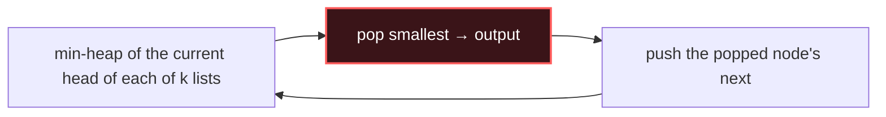

# K-way Merge

## Signal keywords
<span class="chip">merge k sorted lists</span> <span class="chip">kth smallest in matrix</span> <span class="chip">smallest range</span> <span class="chip">k pairs smallest sum</span> <span class="chip">merge k streams</span>

## When to use / NOT use

<div class="usenot" markdown>
<div class="wbox use" markdown>

**Use** to combine k already-sorted sequences: a min-heap of the current head from each list always yields the global next-smallest.

</div>
<div class="wbox avoid" markdown>

**Not** when inputs aren't sorted (sort or use a different structure first).

</div>
</div>

## Diagram


## Mnemonic
!!! tip "Mnemonic"
    **Heap the k heads; pop smallest.**

## Template
=== "Java"
    ```java
    ListNode mergeK(ListNode[] lists) {
        PriorityQueue<ListNode> pq = new PriorityQueue<>((a, b) -> a.val - b.val);
        for (ListNode l : lists) if (l != null) pq.offer(l);  // seed with heads
        ListNode dummy = new ListNode(0), tail = dummy;
        while (!pq.isEmpty()) {
            ListNode node = pq.poll();          // smallest current head
            tail.next = node; tail = node;
            if (node.next != null) pq.offer(node.next);  // push its successor
        }
        return dummy.next;
    }
    ```
=== "Python"
    ```python
    import heapq
    def merge_k(lists):
        pq = [(l.val, i, l) for i, l in enumerate(lists) if l]  # (val, tiebreak, node)
        heapq.heapify(pq)
        dummy = tail = ListNode(0)
        while pq:
            _, i, node = heapq.heappop(pq)
            tail.next = node; tail = node
            if node.next: heapq.heappush(pq, (node.next.val, i, node.next))
        return dummy.next
    ```
=== "C++"
    ```cpp
    ListNode* mergeK(vector<ListNode*>& lists) {
        auto cmp = [](ListNode* a, ListNode* b){ return a->val > b->val; };
        priority_queue<ListNode*, vector<ListNode*>, decltype(cmp)> pq(cmp);
        for (auto l : lists) if (l) pq.push(l);
        ListNode dummy(0), *tail = &dummy;
        while (!pq.empty()) {
            ListNode* node = pq.top(); pq.pop();
            tail->next = node; tail = node;
            if (node->next) pq.push(node->next);
        }
        return dummy.next;
    }
    ```

## Complexity
**Time O(N log k)** — N total elements, heap of size ≤ k. **Space O(k)** for the heap.

## Pitfalls

- Seeding null lists into the heap.
- Comparator overflow on `a.val - b.val`.
- Forgetting to push `node.next` after popping.
- A Python heap needs a tiebreak index so it never compares raw nodes.

## Canonical problems
1. [Merge Two Sorted Lists](https://leetcode.com/problems/merge-two-sorted-lists/) <span class="diff-e">Easy</span>
2. [Kth Smallest Element in a Sorted Matrix](https://leetcode.com/problems/kth-smallest-element-in-a-sorted-matrix/) <span class="diff-m">Medium</span>
3. [Find K Pairs with Smallest Sums](https://leetcode.com/problems/find-k-pairs-with-smallest-sums/) <span class="diff-m">Medium</span>
4. [Merge k Sorted Lists](https://leetcode.com/problems/merge-k-sorted-lists/) <span class="diff-h">Hard</span>
5. [Smallest Range Covering Elements from K Lists](https://leetcode.com/problems/smallest-range-covering-elements-from-k-lists/) <span class="diff-h">Hard</span>
