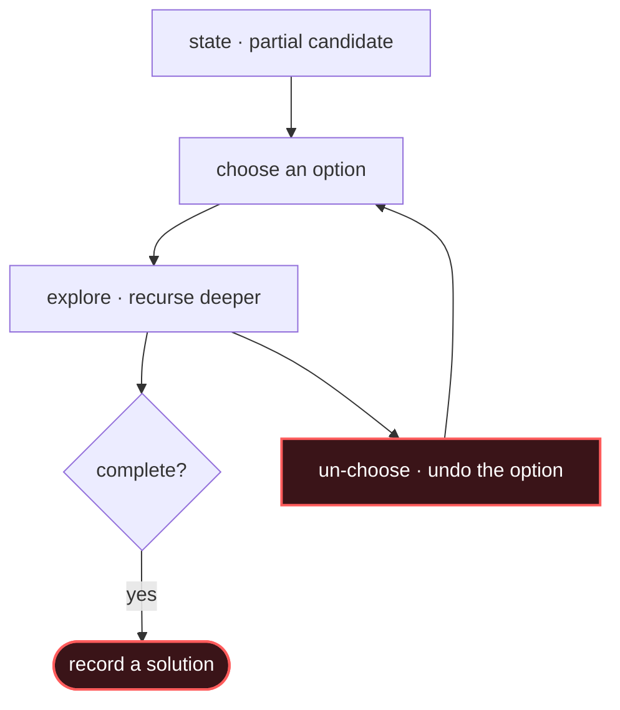

# Backtracking

## Signal keywords
<span class="chip">all subsets / permutations / subsequences</span> <span class="chip">combinations to target</span> <span class="chip">generate all ways</span> <span class="chip">N-Queens / sudoku</span> <span class="chip">word search</span>

## When to use / NOT use

<div class="usenot" markdown>
<div class="wbox use" markdown>

**Use** to enumerate every valid configuration by building a candidate incrementally and undoing each choice on the way back.

</div>
<div class="wbox avoid" markdown>

**Not** when you only need a count or an optimum with overlapping subproblems (→ DP) — backtracking is exponential.

</div>
</div>

## Diagram


## Mnemonic
!!! tip "Mnemonic"
    **Choose, explore, un-choose.**

## Template
=== "Java"
    ```java
    void backtrack(int[] nums, int start, List<Integer> path,
                   List<List<Integer>> res) {
        res.add(new ArrayList<>(path));         // record a COPY of current path
        for (int i = start; i < nums.length; i++) {
            path.add(nums[i]);                  // choose
            backtrack(nums, i + 1, path, res);  // explore (i+1 = no reuse)
            path.remove(path.size() - 1);       // un-choose (backtrack)
        }
    }
    ```
=== "Python"
    ```python
    def backtrack(nums, start, path, res):
        res.append(path[:])                  # copy current path
        for i in range(start, len(nums)):
            path.append(nums[i])             # choose
            backtrack(nums, i + 1, path, res)  # explore
            path.pop()                       # un-choose
    ```
=== "C++"
    ```cpp
    void backtrack(vector<int>& nums, int start,
                   vector<int>& path, vector<vector<int>>& res) {
        res.push_back(path);                 // copy current path
        for (int i = start; i < nums.size(); i++) {
            path.push_back(nums[i]);         // choose
            backtrack(nums, i + 1, path, res);  // explore
            path.pop_back();                 // un-choose
        }
    }
    ```

## Complexity
**Time O(branch^depth)** — exponential in the search tree. **Space O(depth)** for the recursion path (plus the output).

## Pitfalls

- Storing a reference to `path` instead of a copy (every result mutates together).
- Wrong `start` index (`i` for reuse, `i+1` for no reuse).
- Not pruning invalid branches early.
- Forgetting to undo the choice after recursing.

## Canonical problems
1. [Letter Case Permutation](https://leetcode.com/problems/letter-case-permutation/) <span class="diff-e">Easy</span>
2. [Subsets](https://leetcode.com/problems/subsets/) <span class="diff-m">Medium</span>
3. [Permutations](https://leetcode.com/problems/permutations/) <span class="diff-m">Medium</span>
4. [Combination Sum](https://leetcode.com/problems/combination-sum/) <span class="diff-m">Medium</span>
5. [N-Queens](https://leetcode.com/problems/n-queens/) <span class="diff-h">Hard</span>
