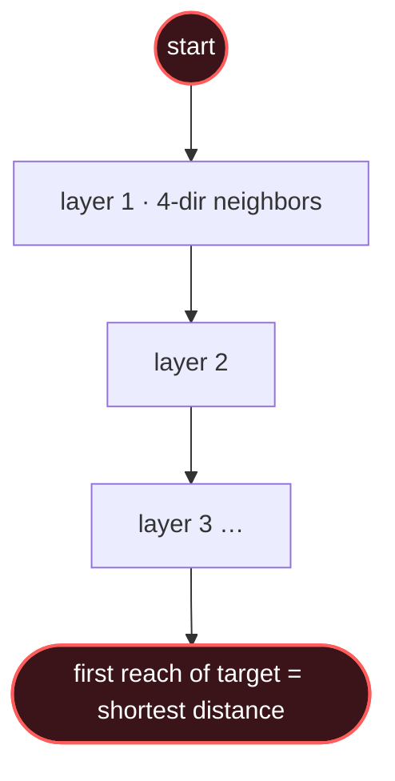

# Graph BFS

## Signal keywords
<span class="chip">shortest / fewest steps</span> <span class="chip">unweighted</span> <span class="chip">minimum moves in a grid</span> <span class="chip">spread by layer</span> <span class="chip">nearest</span>

## When to use / NOT use

<div class="usenot" markdown>
<div class="wbox use" markdown>

**Use** for shortest path or minimum steps in an *unweighted* graph or grid — BFS expands in distance layers, so the first time you reach a node is the shortest.

</div>
<div class="wbox avoid" markdown>

**Not** for weighted edges (→ Dijkstra) or enumerating all paths (→ DFS).

</div>
</div>

## Diagram


## Mnemonic
!!! tip "Mnemonic"
    **Queue neighbors; nearest layers first.**

## Template
=== "Java"
    ```java
    int bfs(int[][] grid, int[] start, int[] end) {
        int m = grid.length, n = grid[0].length;
        boolean[][] seen = new boolean[m][n];
        Queue<int[]> q = new LinkedList<>();
        q.add(start); seen[start[0]][start[1]] = true;
        int[][] dirs = {{1,0},{-1,0},{0,1},{0,-1}};
        for (int steps = 0; !q.isEmpty(); steps++) {
            for (int s = q.size(); s > 0; s--) {       // one layer
                int[] c = q.poll();
                if (c[0]==end[0] && c[1]==end[1]) return steps;
                for (int[] d : dirs) {
                    int r = c[0]+d[0], k = c[1]+d[1];
                    if (r<0||r>=m||k<0||k>=n||seen[r][k]||grid[r][k]==1) continue;
                    seen[r][k] = true; q.add(new int[]{r, k});  // mark on enqueue
                }
            }
        }
        return -1;
    }
    ```
=== "Python"
    ```python
    from collections import deque
    def bfs(grid, start, end):
        m, n = len(grid), len(grid[0])
        seen = {start}; q = deque([start]); steps = 0
        while q:
            for _ in range(len(q)):                 # one layer
                r, c = q.popleft()
                if (r, c) == end: return steps
                for dr, dc in ((1,0),(-1,0),(0,1),(0,-1)):
                    nr, nc = r+dr, c+dc
                    if 0<=nr<m and 0<=nc<n and (nr,nc) not in seen and grid[nr][nc]==0:
                        seen.add((nr,nc)); q.append((nr,nc))
            steps += 1
        return -1
    ```
=== "C++"
    ```cpp
    int bfs(vector<vector<int>>& g, pair<int,int> s, pair<int,int> e) {
        int m = g.size(), n = g[0].size();
        vector<vector<bool>> seen(m, vector<bool>(n));
        queue<pair<int,int>> q; q.push(s); seen[s.first][s.second] = true;
        int dirs[4][2] = {{1,0},{-1,0},{0,1},{0,-1}};
        for (int steps = 0; !q.empty(); steps++)
            for (int sz = q.size(); sz > 0; sz--) {
                auto [r, c] = q.front(); q.pop();
                if (r==e.first && c==e.second) return steps;
                for (auto& d : dirs) {
                    int nr=r+d[0], nc=c+d[1];
                    if (nr<0||nr>=m||nc<0||nc>=n||seen[nr][nc]||g[nr][nc]) continue;
                    seen[nr][nc]=true; q.push({nr,nc});
                }
            }
        return -1;
    }
    ```

## Complexity
**Time O(V + E)** — every node and edge once (grid: O(m·n)). **Space O(V)** for the queue and visited set.

## Pitfalls

- Marking visited on *dequeue* instead of *enqueue* (nodes get queued many times).
- Missing bounds checks.
- Not iterating a full layer per step when you need distances.
- Using BFS on weighted edges.

## Canonical problems
1. [Flood Fill](https://leetcode.com/problems/flood-fill/) <span class="diff-e">Easy</span>
2. [Number of Islands](https://leetcode.com/problems/number-of-islands/) <span class="diff-m">Medium</span>
3. [Rotting Oranges](https://leetcode.com/problems/rotting-oranges/) <span class="diff-m">Medium</span>
4. [01 Matrix](https://leetcode.com/problems/01-matrix/) <span class="diff-m">Medium</span>
5. [Word Ladder](https://leetcode.com/problems/word-ladder/) <span class="diff-h">Hard</span>
