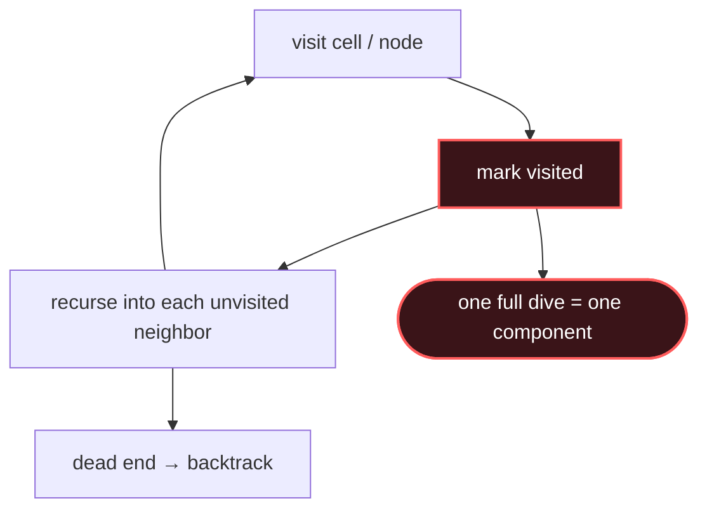

# Graph DFS

## Signal keywords
<span class="chip">connected components</span> <span class="chip">count regions / islands</span> <span class="chip">flood fill</span> <span class="chip">cycle detection</span> <span class="chip">reachability</span>

## When to use / NOT use

<div class="usenot" markdown>
<div class="wbox use" markdown>

**Use** to explore full reachability — count components, measure regions, detect cycles, or clone a graph. Recurse (or use an explicit stack), marking nodes visited.

</div>
<div class="wbox avoid" markdown>

**Not** for shortest path in an unweighted graph (→ Graph BFS).

</div>
</div>

## Diagram


## Mnemonic
!!! tip "Mnemonic"
    **Dive deep; mark, recurse, backtrack.**

## Template
=== "Java"
    ```java
    void dfs(char[][] g, int r, int c) {
        if (r<0||r>=g.length||c<0||c>=g[0].length||g[r][c]!='1') return;
        g[r][c] = '0';                       // mark visited (sink land)
        dfs(g, r+1, c); dfs(g, r-1, c);
        dfs(g, r, c+1); dfs(g, r, c-1);      // 4 neighbors
    }
    int numIslands(char[][] g) {
        int count = 0;
        for (int r = 0; r < g.length; r++)
            for (int c = 0; c < g[0].length; c++)
                if (g[r][c] == '1') { count++; dfs(g, r, c); }  // new component
        return count;
    }
    ```
=== "Python"
    ```python
    def num_islands(g):
        def dfs(r, c):
            if not (0<=r<len(g) and 0<=c<len(g[0])) or g[r][c] != '1': return
            g[r][c] = '0'                    # mark
            for dr, dc in ((1,0),(-1,0),(0,1),(0,-1)):
                dfs(r+dr, c+dc)
        count = 0
        for r in range(len(g)):
            for c in range(len(g[0])):
                if g[r][c] == '1':
                    count += 1; dfs(r, c)    # new component
        return count
    ```
=== "C++"
    ```cpp
    void dfs(vector<vector<char>>& g, int r, int c) {
        if (r<0||r>=g.size()||c<0||c>=g[0].size()||g[r][c]!='1') return;
        g[r][c] = '0';                       // mark
        dfs(g,r+1,c); dfs(g,r-1,c); dfs(g,r,c+1); dfs(g,r,c-1);
    }
    int numIslands(vector<vector<char>>& g) {
        int count = 0;
        for (int r=0;r<g.size();r++)
            for (int c=0;c<g[0].size();c++)
                if (g[r][c]=='1') { count++; dfs(g,r,c); }
        return count;
    }
    ```

## Complexity
**Time O(V + E)** — each node/edge once (grid: O(m·n)). **Space O(V)** for the recursion stack / visited set.

## Pitfalls

- Not marking visited (infinite recursion).
- Marking too late so neighbors re-enter.
- Stack overflow on very large grids (switch to an explicit stack).
- Directed-cycle detection needs an on-stack / 3-color state, not just "visited".

## Canonical problems
1. [Flood Fill](https://leetcode.com/problems/flood-fill/) <span class="diff-e">Easy</span>
2. [Number of Islands](https://leetcode.com/problems/number-of-islands/) <span class="diff-m">Medium</span>
3. [Max Area of Island](https://leetcode.com/problems/max-area-of-island/) <span class="diff-m">Medium</span>
4. [Clone Graph](https://leetcode.com/problems/clone-graph/) <span class="diff-m">Medium</span>
5. [Course Schedule](https://leetcode.com/problems/course-schedule/) <span class="diff-m">Medium</span>
