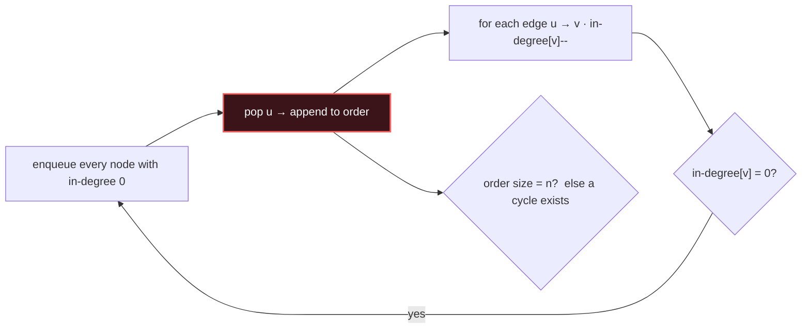

# Topological Sort

## Signal keywords
<span class="chip">dependencies / prerequisites</span> <span class="chip">build order</span> <span class="chip">course schedule</span> <span class="chip">DAG ordering</span> <span class="chip">can finish?</span>

## When to use / NOT use

<div class="usenot" markdown>
<div class="wbox use" markdown>

**Use** to linearly order the nodes of a **DAG** so every edge points forward — task scheduling with prerequisites. Kahn's BFS also detects cycles (not all nodes emitted ⇒ cycle).

</div>
<div class="wbox avoid" markdown>

**Not** on undirected graphs or where cycles are allowed.

</div>
</div>

## Diagram


## Mnemonic
!!! tip "Mnemonic"
    **Zero in-degree first; peel forward.**

## Template
=== "Java"
    ```java
    int[] topoSort(int n, int[][] edges) {
        List<List<Integer>> g = new ArrayList<>();
        int[] indeg = new int[n];
        for (int i = 0; i < n; i++) g.add(new ArrayList<>());
        for (int[] e : edges) { g.get(e[0]).add(e[1]); indeg[e[1]]++; }
        Queue<Integer> q = new LinkedList<>();
        for (int i = 0; i < n; i++) if (indeg[i] == 0) q.add(i);  // sources
        int[] order = new int[n]; int k = 0;
        while (!q.isEmpty()) {
            int u = q.poll(); order[k++] = u;
            for (int v : g.get(u)) if (--indeg[v] == 0) q.add(v);
        }
        return k == n ? order : new int[0];   // short output => cycle
    }
    ```
=== "Python"
    ```python
    from collections import deque
    def topo_sort(n, edges):
        g = [[] for _ in range(n)]; indeg = [0]*n
        for a, b in edges:
            g[a].append(b); indeg[b] += 1
        q = deque(i for i in range(n) if indeg[i] == 0)  # sources
        order = []
        while q:
            u = q.popleft(); order.append(u)
            for v in g[u]:
                indeg[v] -= 1
                if indeg[v] == 0: q.append(v)
        return order if len(order) == n else []  # cycle -> []
    ```
=== "C++"
    ```cpp
    vector<int> topoSort(int n, vector<vector<int>>& edges) {
        vector<vector<int>> g(n); vector<int> indeg(n, 0);
        for (auto& e : edges) { g[e[0]].push_back(e[1]); indeg[e[1]]++; }
        queue<int> q;
        for (int i = 0; i < n; i++) if (!indeg[i]) q.push(i);
        vector<int> order;
        while (!q.empty()) {
            int u = q.front(); q.pop(); order.push_back(u);
            for (int v : g[u]) if (--indeg[v] == 0) q.push(v);
        }
        return order.size() == n ? order : vector<int>{};
    }
    ```

## Complexity
**Time O(V + E)** — build in-degrees, then each edge relaxed once. **Space O(V + E)** for the adjacency list and queue.

## Pitfalls

- Forgetting the cycle check (`emitted == n`).
- Reversing edge direction.
- Not seeding *all* zero-in-degree sources.
- Assuming a unique order (many are valid) when the problem demands lexicographically smallest (use a heap).

## Canonical problems
1. [Course Schedule](https://leetcode.com/problems/course-schedule/) <span class="diff-m">Medium</span>
2. [Course Schedule II](https://leetcode.com/problems/course-schedule-ii/) <span class="diff-m">Medium</span>
3. [Minimum Height Trees](https://leetcode.com/problems/minimum-height-trees/) <span class="diff-m">Medium</span>
4. [Sequence Reconstruction](https://leetcode.com/problems/sequence-reconstruction/) <span class="diff-m">Medium</span>
5. [Alien Dictionary](https://leetcode.com/problems/alien-dictionary/) <span class="diff-h">Hard</span>
