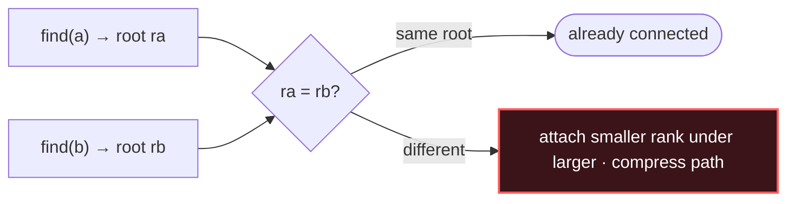

# Union-Find

## Signal keywords
<span class="chip">dynamic connectivity</span> <span class="chip">are they connected?</span> <span class="chip">number of groups</span> <span class="chip">redundant edge</span> <span class="chip">merge sets</span>

## When to use / NOT use

<div class="usenot" markdown>
<div class="wbox use" markdown>

**Use** for near-constant-time grouping and "are A and B connected?" as edges arrive — components, cycle detection in an undirected graph, Kruskal's MST.

</div>
<div class="wbox avoid" markdown>

**Not** when you must *remove* edges or recover the actual path between nodes.

</div>
</div>

## Diagram


## Mnemonic
!!! tip "Mnemonic"
    **Union by rank; compress the path.**

## Template
=== "Java"
    ```java
    int[] parent, rank;
    int find(int x) {                               // path compression
        return parent[x] == x ? x : (parent[x] = find(parent[x]));
    }
    boolean union(int a, int b) {
        int ra = find(a), rb = find(b);
        if (ra == rb) return false;                 // already together
        if (rank[ra] < rank[rb]) { int t = ra; ra = rb; rb = t; }
        parent[rb] = ra;                            // attach smaller under larger
        if (rank[ra] == rank[rb]) rank[ra]++;
        return true;
    }
    ```
=== "Python"
    ```python
    parent, rank = list(range(n)), [0]*n
    def find(x):
        while parent[x] != x:
            parent[x] = parent[parent[x]]   # path halving
            x = parent[x]
        return x
    def union(a, b):
        ra, rb = find(a), find(b)
        if ra == rb: return False
        if rank[ra] < rank[rb]: ra, rb = rb, ra
        parent[rb] = ra
        if rank[ra] == rank[rb]: rank[ra] += 1
        return True
    ```
=== "C++"
    ```cpp
    vector<int> parent, rnk;
    int find(int x) { return parent[x]==x ? x : parent[x]=find(parent[x]); }
    bool unite(int a, int b) {
        int ra = find(a), rb = find(b);
        if (ra == rb) return false;
        if (rnk[ra] < rnk[rb]) swap(ra, rb);
        parent[rb] = ra;
        if (rnk[ra] == rnk[rb]) rnk[ra]++;
        return true;
    }
    ```

## Complexity
**Time ~O(α(n))** per `find`/`union` — inverse Ackermann, effectively constant. **Space O(n)** for parent + rank arrays.

## Pitfalls

- Dropping path compression *or* union-by-rank (degrades to O(n)).
- Forgetting `parent[i] = i` init.
- Using it when edges get deleted.
- Component count = number of distinct roots, not `n - unions` unless you track it.

## Canonical problems
1. [Number of Provinces](https://leetcode.com/problems/number-of-provinces/) <span class="diff-m">Medium</span>
2. [Redundant Connection](https://leetcode.com/problems/redundant-connection/) <span class="diff-m">Medium</span>
3. [Number of Connected Components in an Undirected Graph](https://leetcode.com/problems/number-of-connected-components-in-an-undirected-graph/) <span class="diff-m">Medium</span>
4. [Accounts Merge](https://leetcode.com/problems/accounts-merge/) <span class="diff-m">Medium</span>
5. [Making A Large Island](https://leetcode.com/problems/making-a-large-island/) <span class="diff-h">Hard</span>
