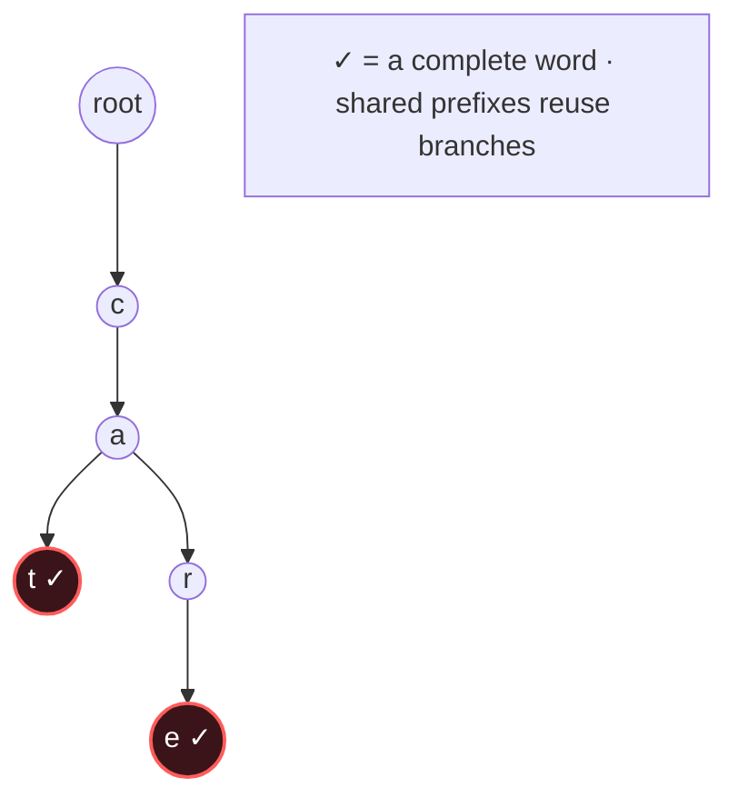

# Trie

## Signal keywords
<span class="chip">prefix / starts-with</span> <span class="chip">autocomplete</span> <span class="chip">dictionary</span> <span class="chip">word search grid</span> <span class="chip">max XOR</span>

## When to use / NOT use

<div class="usenot" markdown>
<div class="wbox use" markdown>

**Use** when many strings share prefixes and you query by prefix or whole word — autocomplete, spell-check, grid word search.

</div>
<div class="wbox avoid" markdown>

**Not** for single membership checks (a `HashSet` is simpler) or queries that aren't prefix-shaped.

</div>
</div>

## Diagram


## Mnemonic
!!! tip "Mnemonic"
    **Branch per character; flag word ends.**

## Template
=== "Java"
    ```java
    class Trie {
        Trie[] child = new Trie[26];
        boolean end;
        void insert(String w) {
            Trie node = this;
            for (char c : w.toCharArray()) {
                int i = c - 'a';
                if (node.child[i] == null) node.child[i] = new Trie();  // branch
                node = node.child[i];
            }
            node.end = true;                          // mark word end
        }
        boolean find(String w, boolean prefix) {
            Trie node = this;
            for (char c : w.toCharArray()) {
                node = node.child[c - 'a'];
                if (node == null) return false;
            }
            return prefix || node.end;                // prefix vs full word
        }
    }
    ```
=== "Python"
    ```python
    class Trie:
        def __init__(self):
            self.child = {}; self.end = False
        def insert(self, w):
            node = self
            for c in w:
                node = node.child.setdefault(c, Trie())  # branch
            node.end = True                              # mark end
        def find(self, w, prefix):
            node = self
            for c in w:
                if c not in node.child: return False
                node = node.child[c]
            return prefix or node.end
    ```
=== "C++"
    ```cpp
    struct Trie {
        Trie* child[26] = {};
        bool end = false;
        void insert(const string& w) {
            Trie* node = this;
            for (char c : w) {
                int i = c - 'a';
                if (!node->child[i]) node->child[i] = new Trie();
                node = node->child[i];
            }
            node->end = true;
        }
        bool find(const string& w, bool prefix) {
            Trie* node = this;
            for (char c : w) {
                node = node->child[c - 'a'];
                if (!node) return false;
            }
            return prefix || node->end;
        }
    };
    ```

## Complexity
**Time O(L)** per insert/search (L = word length), independent of how many words are stored. **Space O(alphabet × total chars)** — swap the array for a map when the alphabet is large.

## Pitfalls

- Not marking `end` (can't tell prefix from a stored word).
- Hard-coding a 26-letter array for unicode/large alphabets.
- Null-check on descent.
- Memory blow-up — a HashMap of children saves space on sparse tries.

## Canonical problems
1. [Implement Trie (Prefix Tree)](https://leetcode.com/problems/implement-trie-prefix-tree/) <span class="diff-m">Medium</span>
2. [Replace Words](https://leetcode.com/problems/replace-words/) <span class="diff-m">Medium</span>
3. [Design Add and Search Words Data Structure](https://leetcode.com/problems/design-add-and-search-words-data-structure/) <span class="diff-m">Medium</span>
4. [Maximum XOR of Two Numbers in an Array](https://leetcode.com/problems/maximum-xor-of-two-numbers-in-an-array/) <span class="diff-m">Medium</span>
5. [Word Search II](https://leetcode.com/problems/word-search-ii/) <span class="diff-h">Hard</span>
