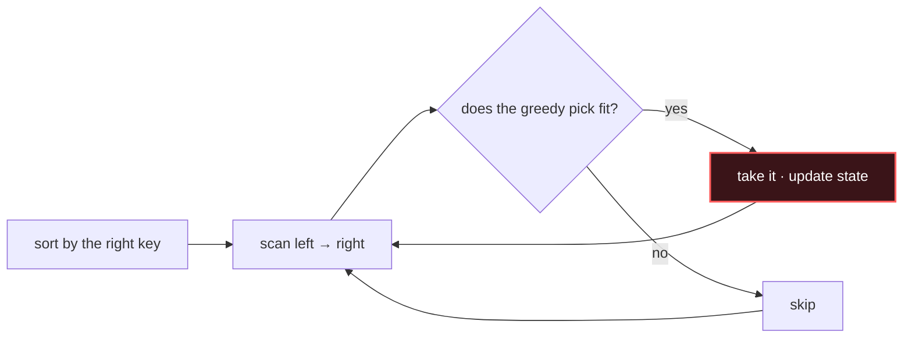

# Greedy

## Signal keywords
<span class="chip">maximize / minimize</span> <span class="chip">interval scheduling</span> <span class="chip">jump / reach</span> <span class="chip">assign / ration</span> <span class="chip">earliest / latest</span>

## When to use / NOT use

<div class="usenot" markdown>
<div class="wbox use" markdown>

**Use** when a locally optimal choice provably yields the global optimum (justify with an exchange or "stays-ahead" argument) — usually after sorting on the right key.

</div>
<div class="wbox avoid" markdown>

**Not** when choices interact and create overlapping subproblems (→ DP); a greedy guess there is often wrong.

</div>
</div>

## Diagram


## Mnemonic
!!! tip "Mnemonic"
    **Take the best local move now.**

## Template
=== "Java"
    ```java
    int maxNonOverlap(int[][] iv) {
        Arrays.sort(iv, (a, b) -> Integer.compare(a[1], b[1]));  // by end time
        int count = 0, end = Integer.MIN_VALUE;
        for (int[] x : iv) {
            if (x[0] >= end) {           // starts after last chosen ends
                count++; end = x[1];     // greedily keep earliest finisher
            }
        }
        return count;
    }
    ```
=== "Python"
    ```python
    def max_non_overlap(iv):
        iv.sort(key=lambda x: x[1])      # by end time
        count, end = 0, float("-inf")
        for s, e in iv:
            if s >= end:                 # fits after last chosen
                count += 1; end = e      # take earliest finisher
        return count
    ```
=== "C++"
    ```cpp
    int maxNonOverlap(vector<vector<int>>& iv) {
        sort(iv.begin(), iv.end(),
             [](auto& a, auto& b){ return a[1] < b[1]; });  // by end
        int count = 0, end = INT_MIN;
        for (auto& x : iv)
            if (x[0] >= end) { count++; end = x[1]; }
        return count;
    }
    ```

## Complexity
**Time O(n log n)** dominated by the sort (the scan is O(n)). **Space O(1)**.

## Pitfalls

- Assuming greedy works without proof — many "obvious" greedies are wrong.
- Sorting on the wrong key (end vs start vs ratio).
- Mishandling ties.
- Confusing a greedy problem with one that truly needs DP.

## Canonical problems
1. [Assign Cookies](https://leetcode.com/problems/assign-cookies/) <span class="diff-e">Easy</span>
2. [Jump Game](https://leetcode.com/problems/jump-game/) <span class="diff-m">Medium</span>
3. [Gas Station](https://leetcode.com/problems/gas-station/) <span class="diff-m">Medium</span>
4. [Task Scheduler](https://leetcode.com/problems/task-scheduler/) <span class="diff-m">Medium</span>
5. [Non-overlapping Intervals](https://leetcode.com/problems/non-overlapping-intervals/) <span class="diff-m">Medium</span>
