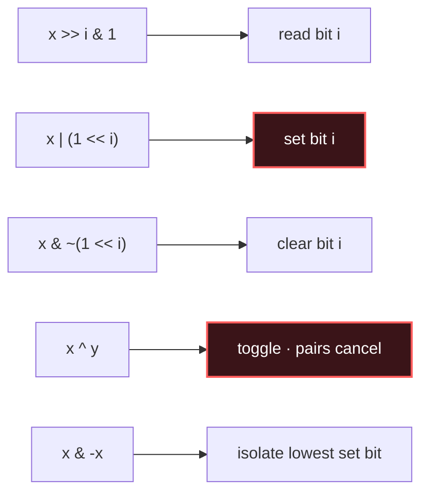

# Bit Manipulation

## Signal keywords
<span class="chip">single number / XOR</span> <span class="chip">count bits</span> <span class="chip">power of two</span> <span class="chip">bitmask subsets</span> <span class="chip">toggle / flags</span>

## When to use / NOT use

<div class="usenot" markdown>
<div class="wbox use" markdown>

**Use** for set membership as a bitmask, parity/XOR cancellation (pairs vanish), low-level flags, or enumerating subsets of ≤ ~20 items.

</div>
<div class="wbox avoid" markdown>

**Not** when readability matters more than the micro-optimization — bit tricks are easy to get subtly wrong.

</div>
</div>

## Diagram


## Mnemonic
!!! tip "Mnemonic"
    **Mask, shift, XOR to toggle.**

## Template
=== "Java"
    ```java
    boolean getBit(int x, int i) { return (x >> i & 1) == 1; }  // read
    int setBit(int x, int i)     { return x | (1 << i); }       // set
    int clearBit(int x, int i)   { return x & ~(1 << i); }      // clear
    int lowestSetBit(int x)      { return x & -x; }             // isolate low 1

    int singleNumber(int[] a) {         // XOR cancels every pair
        int r = 0;
        for (int v : a) r ^= v;
        return r;                        // the lone unpaired value
    }
    ```
=== "Python"
    ```python
    def get_bit(x, i):   return (x >> i) & 1          # read
    def set_bit(x, i):   return x | (1 << i)          # set
    def clear_bit(x, i): return x & ~(1 << i)         # clear
    def lowest_set(x):   return x & -x                # isolate low 1

    def single_number(a):
        r = 0
        for v in a: r ^= v               # pairs cancel
        return r
    ```
=== "C++"
    ```cpp
    bool getBit(int x, int i)  { return (x >> i & 1) == 1; }
    int  setBit(int x, int i)  { return x | (1 << i); }
    int  clearBit(int x, int i){ return x & ~(1 << i); }
    int  lowestSetBit(int x)   { return x & -x; }

    int singleNumber(vector<int>& a) {
        int r = 0;
        for (int v : a) r ^= v;          // pairs cancel
        return r;
    }
    ```

## Complexity
**Time O(1)** per bit op; O(n) for a scan like `singleNumber`. **Space O(1)**.

## Pitfalls

- Signed `>>` vs unsigned `>>>` in Java.
- `1 << 31` overflows `int` (use `1L`).
- Operator precedence — always parenthesize masks.
- Off-by-one on bit indices.

## Canonical problems
1. [Number of 1 Bits](https://leetcode.com/problems/number-of-1-bits/) <span class="diff-e">Easy</span>
2. [Single Number](https://leetcode.com/problems/single-number/) <span class="diff-e">Easy</span>
3. [Counting Bits](https://leetcode.com/problems/counting-bits/) <span class="diff-e">Easy</span>
4. [Sum of Two Integers](https://leetcode.com/problems/sum-of-two-integers/) <span class="diff-m">Medium</span>
5. [Single Number II](https://leetcode.com/problems/single-number-ii/) <span class="diff-m">Medium</span>
