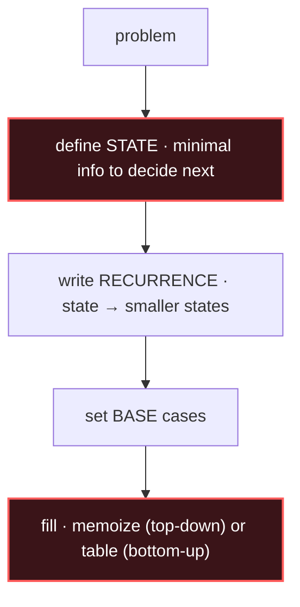

<!-- MEGA-PAGE: DP intentionally spans more than one screen (6 sub-cards).
     This is the one sanctioned exception to the one-screen rule. -->

# Dynamic Programming

## Signal keywords
<span class="chip">count the ways</span> <span class="chip">min / max cost</span> <span class="chip">longest / shortest</span> <span class="chip">can you reach target</span> <span class="chip">overlapping subproblems</span> <span class="chip">subsequence, not contiguous</span>

## When to use / NOT use

<div class="usenot" markdown>
<div class="wbox use" markdown>

**Use** when a problem has *optimal substructure* (answer built from sub-answers) **and** *overlapping subproblems* (same sub-answers recomputed). Define a state, write the recurrence, then memoize or fill a table bottom-up.

</div>
<div class="wbox avoid" markdown>

**Not** when a greedy choice is provably optimal (→ Greedy) or subproblems don't repeat (→ plain recursion / divide & conquer).

</div>
</div>

## Diagram


## Mnemonic
!!! tip "Mnemonic"
    **Define state, recur, memoize, build up.**

## The six recurrences

### 1. 1-D / Fibonacci — `dp[i]` from `dp[i-1], dp[i-2]`
=== "Java"
    ```java
    int rob(int[] a) {                   // House Robber
        int prev = 0, cur = 0;           // dp[i-2], dp[i-1]
        for (int x : a) {
            int take = prev + x;         // rob this one
            prev = cur;
            cur = Math.max(cur, take);   // best of skip vs rob
        }
        return cur;
    }
    ```
=== "Python"
    ```python
    def rob(a):
        prev = cur = 0                   # dp[i-2], dp[i-1]
        for x in a:
            prev, cur = cur, max(cur, prev + x)
        return cur
    ```
=== "C++"
    ```cpp
    int rob(vector<int>& a) {
        int prev = 0, cur = 0;
        for (int x : a) { int t = prev + x; prev = cur; cur = max(cur, t); }
        return cur;
    }
    ```
_Problems: Climbing Stairs (E), House Robber (M)._

### 2. Grid / Kadane — extend or restart a run
```java
int maxSubArray(int[] a) {               // Kadane
    int best = a[0], cur = a[0];
    for (int i = 1; i < a.length; i++) {
        cur = Math.max(a[i], cur + a[i]);  // restart vs extend
        best = Math.max(best, cur);
    }
    return best;
}
```
_Problems: Maximum Subarray (E), Unique Paths (M), Minimum Path Sum (M)._

### 3. 0/1 Knapsack — each item once, iterate weight **descending**
```java
int knap01(int[] wt, int[] val, int cap) {
    int[] dp = new int[cap + 1];
    for (int i = 0; i < wt.length; i++)
        for (int w = cap; w >= wt[i]; w--)          // descending = use once
            dp[w] = Math.max(dp[w], dp[w - wt[i]] + val[i]);
    return dp[cap];
}
```
_Problems: Partition Equal Subset Sum (M), Target Sum (M)._

### 4. Unbounded Knapsack — reuse items, iterate weight **ascending**
```java
int coinChange(int[] coins, int amount) {
    int[] dp = new int[amount + 1];
    Arrays.fill(dp, amount + 1); dp[0] = 0;
    for (int c : coins)
        for (int a = c; a <= amount; a++)           // ascending = reuse
            dp[a] = Math.min(dp[a], dp[a - c] + 1);
    return dp[amount] > amount ? -1 : dp[amount];
}
```
_Problems: Coin Change (M), Coin Change II (M)._

### 5. LCS — 2-D over two sequences
```java
int lcs(String s, String t) {
    int m = s.length(), n = t.length();
    int[][] dp = new int[m + 1][n + 1];
    for (int i = 1; i <= m; i++)
        for (int j = 1; j <= n; j++)
            dp[i][j] = s.charAt(i-1) == t.charAt(j-1)
                ? dp[i-1][j-1] + 1                   // match -> diagonal + 1
                : Math.max(dp[i-1][j], dp[i][j-1]);  // else drop one char
    return dp[m][n];
}
```
_Problems: Longest Common Subsequence (M), Edit Distance (H)._

### 6. LIS — patience sorting, O(n log n)
```java
int lis(int[] a) {
    List<Integer> tails = new ArrayList<>();
    for (int x : a) {
        int i = Collections.binarySearch(tails, x);
        if (i < 0) i = -(i + 1);
        if (i == tails.size()) tails.add(x);        // extend
        else tails.set(i, x);                       // replace first >= x
    }
    return tails.size();
}
```
_Problems: Longest Increasing Subsequence (M), Russian Doll Envelopes (H)._

## Complexity
**Time O(states × transitions)** — e.g. 1-D O(n), LCS O(m·n), knapsack O(n·cap). **Space O(states)**, often reducible one dimension (rolling array).

## Pitfalls

- Wrong state (missing info to decide next).
- Wrong iteration order (0/1 needs descending weight, unbounded ascending).
- Missing/incorrect base cases.
- Not memoizing top-down (exponential blowup).
- Off-by-one on the `+1` padded table.

## Canonical problems
1. [Climbing Stairs](https://leetcode.com/problems/climbing-stairs/) <span class="diff-e">Easy</span>
2. [Maximum Subarray](https://leetcode.com/problems/maximum-subarray/) <span class="diff-e">Easy</span>
3. [House Robber](https://leetcode.com/problems/house-robber/) <span class="diff-m">Medium</span>
4. [Coin Change](https://leetcode.com/problems/coin-change/) <span class="diff-m">Medium</span>
5. [Longest Common Subsequence](https://leetcode.com/problems/longest-common-subsequence/) <span class="diff-m">Medium</span>
6. [Longest Increasing Subsequence](https://leetcode.com/problems/longest-increasing-subsequence/) <span class="diff-m">Medium</span>
