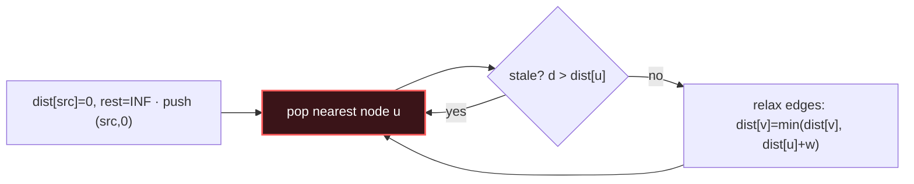

# Dijkstra

## Signal keywords
<span class="chip">weighted · non-negative</span> <span class="chip">min cost to reach</span> <span class="chip">shortest path</span> <span class="chip">network delay</span> <span class="chip">effort / time</span>

## When to use / NOT use

<div class="usenot" markdown>
<div class="wbox use" markdown>

**Use** for single-source shortest paths on a **non-negative** weighted graph — a min-heap always settles the closest unfinished node first, locking in its distance.

</div>
<div class="wbox avoid" markdown>

**Not** with negative edges (→ Bellman-Ford), or on unweighted graphs where plain BFS is simpler and faster.

</div>
</div>

## Diagram


## Mnemonic
!!! tip "Mnemonic"
    **Greedily settle the nearest unvisited node.**

## Template
=== "Java"
    ```java
    int[] dijkstra(List<int[]>[] g, int src, int n) {   // g[u] = list of {v, w}
        int[] dist = new int[n];
        Arrays.fill(dist, Integer.MAX_VALUE); dist[src] = 0;
        PriorityQueue<int[]> pq = new PriorityQueue<>((a, b) -> a[1] - b[1]);
        pq.offer(new int[]{src, 0});
        while (!pq.isEmpty()) {
            int[] c = pq.poll(); int u = c[0], d = c[1];
            if (d > dist[u]) continue;              // skip stale entry
            for (int[] e : g[u])
                if (dist[u] + e[1] < dist[e[0]]) {
                    dist[e[0]] = dist[u] + e[1];
                    pq.offer(new int[]{e[0], dist[e[0]]});
                }
        }
        return dist;
    }
    ```
=== "Python"
    ```python
    import heapq
    def dijkstra(g, src, n):                 # g[u] = list of (v, w)
        dist = [float("inf")] * n; dist[src] = 0
        pq = [(0, src)]
        while pq:
            d, u = heapq.heappop(pq)
            if d > dist[u]: continue         # stale
            for v, w in g[u]:
                if d + w < dist[v]:
                    dist[v] = d + w
                    heapq.heappush(pq, (dist[v], v))
        return dist
    ```
=== "C++"
    ```cpp
    vector<int> dijkstra(vector<vector<pair<int,int>>>& g, int src, int n) {
        vector<int> dist(n, INT_MAX); dist[src] = 0;
        priority_queue<pair<int,int>, vector<pair<int,int>>, greater<>> pq;
        pq.push({0, src});
        while (!pq.empty()) {
            auto [d, u] = pq.top(); pq.pop();
            if (d > dist[u]) continue;
            for (auto [v, w] : g[u])
                if (d + w < dist[v]) { dist[v] = d + w; pq.push({dist[v], v}); }
        }
        return dist;
    }
    ```

## Complexity
**Time O(E log V)** — each edge may push once, heap ops are log V. **Space O(V + E)** for the graph and heap.

## Pitfalls

- Negative edges silently break correctness — use Bellman-Ford instead.
- Not skipping stale heap entries (`d > dist[u]`) — wastes time or re-relaxes.
- Forgetting to initialize `dist` to infinity (only `src = 0`).
- Grid problems: the "weight" is often the cell value or the max along the path.

## Canonical problems
1. [Network Delay Time](https://leetcode.com/problems/network-delay-time/) <span class="diff-m">Medium</span>
2. [Path with Maximum Probability](https://leetcode.com/problems/path-with-maximum-probability/) <span class="diff-m">Medium</span>
3. [Path With Minimum Effort](https://leetcode.com/problems/path-with-minimum-effort/) <span class="diff-m">Medium</span>
4. [Swim in Rising Water](https://leetcode.com/problems/swim-in-rising-water/) <span class="diff-h">Hard</span>
5. [Minimum Obstacle Removal to Reach Corner](https://leetcode.com/problems/minimum-obstacle-removal-to-reach-corner/) <span class="diff-h">Hard</span>
