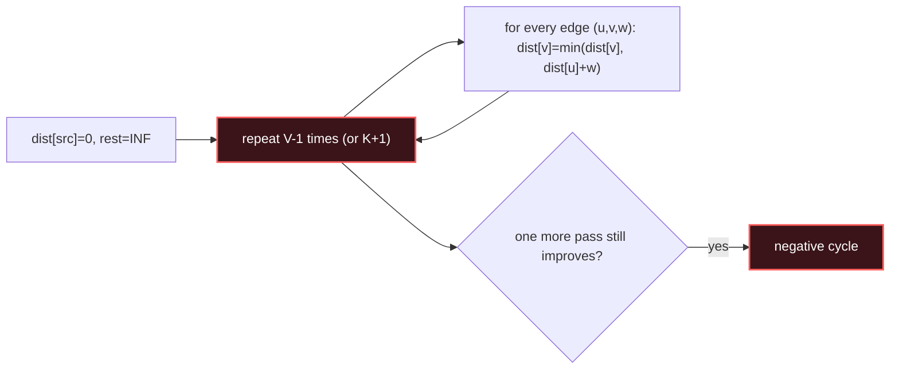

# Bellman-Ford

## Signal keywords
<span class="chip">negative weights</span> <span class="chip">at most K edges/stops</span> <span class="chip">negative cycle</span> <span class="chip">cheapest within K</span> <span class="chip">relax edges</span>

## When to use / NOT use

<div class="usenot" markdown>
<div class="wbox use" markdown>

**Use** when edges can be **negative**, when you must bound the path to **at most K edges**, or to **detect a negative cycle** — relax all edges V−1 times.

</div>
<div class="wbox avoid" markdown>

**Not** on large non-negative graphs where Dijkstra's O(E log V) beats Bellman-Ford's O(V·E).

</div>
</div>

## Diagram


## Mnemonic
!!! tip "Mnemonic"
    **Relax every edge V minus once.**

## Template
=== "Java"
    ```java
    int cheapestKStops(int n, int[][] edges, int src, int dst, int K) {
        int[] dist = new int[n];
        Arrays.fill(dist, Integer.MAX_VALUE); dist[src] = 0;
        for (int i = 0; i <= K; i++) {              // at most K+1 edges
            int[] tmp = dist.clone();               // freeze last round
            for (int[] e : edges) {                 // e = {u, v, w}
                if (dist[e[0]] == Integer.MAX_VALUE) continue;
                tmp[e[1]] = Math.min(tmp[e[1]], dist[e[0]] + e[2]);
            }
            dist = tmp;
        }
        return dist[dst] == Integer.MAX_VALUE ? -1 : dist[dst];
    }
    ```
=== "Python"
    ```python
    def cheapest_k_stops(n, edges, src, dst, K):
        dist = [float("inf")] * n; dist[src] = 0
        for _ in range(K + 1):                   # at most K+1 edges
            tmp = dist[:]                        # freeze last round
            for u, v, w in edges:
                if dist[u] != float("inf"):
                    tmp[v] = min(tmp[v], dist[u] + w)
            dist = tmp
        return -1 if dist[dst] == float("inf") else dist[dst]
    ```
=== "C++"
    ```cpp
    int cheapestKStops(int n, vector<vector<int>>& edges, int src, int dst, int K) {
        vector<int> dist(n, INT_MAX); dist[src] = 0;
        for (int i = 0; i <= K; i++) {
            vector<int> tmp = dist;
            for (auto& e : edges) {
                if (dist[e[0]] == INT_MAX) continue;
                tmp[e[1]] = min(tmp[e[1]], dist[e[0]] + e[2]);
            }
            dist = tmp;
        }
        return dist[dst] == INT_MAX ? -1 : dist[dst];
    }
    ```

## Complexity
**Time O(V · E)** — V−1 rounds over all edges. **Space O(V)** for the distance array.

## Pitfalls

- The K-stops variant needs a **frozen copy** each round, else you use more than K edges in one pass.
- A negative cycle is detected when a V-th relaxation still improves a distance.
- Integer overflow when adding to `INT_MAX` — guard with the "unreachable" check.
- Off-by-one on K (K stops means K+1 edges).

## Canonical problems
1. [Cheapest Flights Within K Stops](https://leetcode.com/problems/cheapest-flights-within-k-stops/) <span class="diff-m">Medium</span>
2. [Network Delay Time](https://leetcode.com/problems/network-delay-time/) <span class="diff-m">Medium</span>
3. [Shortest Path with Alternating Colors](https://leetcode.com/problems/shortest-path-with-alternating-colors/) <span class="diff-m">Medium</span>
4. [Find the City With the Smallest Number of Neighbors](https://leetcode.com/problems/find-the-city-with-the-smallest-number-of-neighbors-at-a-threshold-distance/) <span class="diff-m">Medium</span>
5. [Minimum Cost to Make at Least One Valid Path in a Grid](https://leetcode.com/problems/minimum-cost-to-make-at-least-one-valid-path-in-a-grid/) <span class="diff-h">Hard</span>
