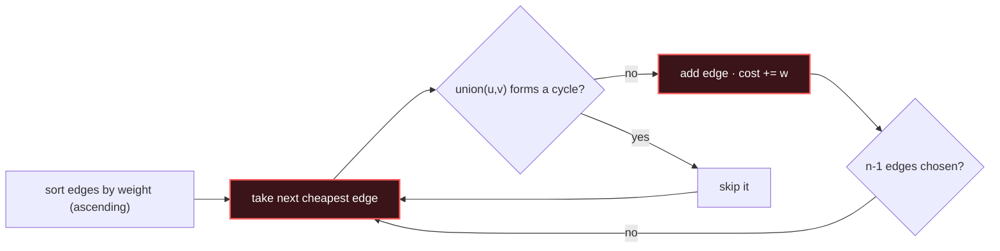

# Minimum Spanning Tree

## Signal keywords
<span class="chip">connect all at min cost</span> <span class="chip">spanning tree</span> <span class="chip">connect points/cities</span> <span class="chip">min wiring</span> <span class="chip">Kruskal / Prim</span>

## When to use / NOT use

<div class="usenot" markdown>
<div class="wbox use" markdown>

**Use** to connect **all** vertices with minimum total edge weight — Kruskal (sort edges + Union-Find) or Prim (grow a tree with a heap).

</div>
<div class="wbox avoid" markdown>

**Not** for shortest path between two nodes (→ Dijkstra), or directed graphs — MST is for undirected connectivity.

</div>
</div>

## Diagram


## Mnemonic
!!! tip "Mnemonic"
    **Cheapest edges that avoid a cycle.**

## Template
=== "Java"
    ```java
    int mst(int n, int[][] edges) {                 // edges = {u, v, w}
        Arrays.sort(edges, (a, b) -> Integer.compare(a[2], b[2]));
        int[] parent = new int[n];
        for (int i = 0; i < n; i++) parent[i] = i;
        int cost = 0, used = 0;
        for (int[] e : edges) {
            int ra = find(parent, e[0]), rb = find(parent, e[1]);
            if (ra != rb) {                         // no cycle -> take edge
                parent[ra] = rb; cost += e[2];
                if (++used == n - 1) break;         // tree complete
            }
        }
        return cost;
    }
    int find(int[] p, int x) { return p[x] == x ? x : (p[x] = find(p, p[x])); }
    ```
=== "Python"
    ```python
    def mst(n, edges):                          # edges = [u, v, w]
        edges.sort(key=lambda e: e[2])
        parent = list(range(n))
        def find(x):
            while parent[x] != x:
                parent[x] = parent[parent[x]]; x = parent[x]
            return x
        cost = used = 0
        for u, v, w in edges:
            ru, rv = find(u), find(v)
            if ru != rv:                        # no cycle
                parent[ru] = rv; cost += w; used += 1
                if used == n - 1: break
        return cost
    ```
=== "C++"
    ```cpp
    int find(vector<int>& p, int x){ return p[x]==x ? x : p[x]=find(p,p[x]); }
    int mst(int n, vector<vector<int>>& edges) {
        sort(edges.begin(), edges.end(),
             [](auto& a, auto& b){ return a[2] < b[2]; });
        vector<int> p(n); iota(p.begin(), p.end(), 0);
        int cost = 0, used = 0;
        for (auto& e : edges) {
            int ra = find(p, e[0]), rb = find(p, e[1]);
            if (ra != rb) { p[ra] = rb; cost += e[2]; if (++used == n-1) break; }
        }
        return cost;
    }
    ```

## Complexity
**Time O(E log E)** for the sort (Union-Find ops are ~O(α)). **Space O(V)** for the parent array.

## Pitfalls

- Needs Union-Find for cycle checks; comparator overflow on `a[2]-b[2]` (use `Integer.compare`).
- Stop once **n−1** edges are chosen.
- A disconnected graph has no spanning tree (`used < n−1`).
- For a complete graph (points), generate all pairwise edges or use Prim to avoid O(n²) memory.

## Canonical problems
1. [Min Cost to Connect All Points](https://leetcode.com/problems/min-cost-to-connect-all-points/) <span class="diff-m">Medium</span>
2. [Connecting Cities With Minimum Cost](https://leetcode.com/problems/connecting-cities-with-minimum-cost/) <span class="diff-m">Medium</span>
3. [Optimize Water Distribution in a Village](https://leetcode.com/problems/optimize-water-distribution-in-a-village/) <span class="diff-h">Hard</span>
4. [Find Critical and Pseudo-Critical Edges in MST](https://leetcode.com/problems/find-critical-and-pseudo-critical-edges-in-minimum-spanning-tree/) <span class="diff-h">Hard</span>
5. [Checking Existence of Edge Length Limited Paths](https://leetcode.com/problems/checking-existence-of-edge-length-limited-paths/) <span class="diff-h">Hard</span>
