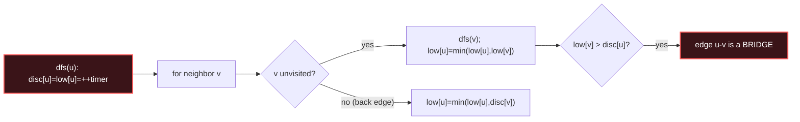

# Tarjan (SCC & Bridges)

## Signal keywords
<span class="chip">strongly connected components</span> <span class="chip">critical connections</span> <span class="chip">bridges</span> <span class="chip">articulation points</span> <span class="chip">low-link</span>

## When to use / NOT use

<div class="usenot" markdown>
<div class="wbox use" markdown>

**Use** to find SCCs, bridges, or articulation points in one DFS by comparing each node's **discovery time** to the lowest reachable **low-link** time.

</div>
<div class="wbox avoid" markdown>

**Not** for plain connectivity or grouping that only merges (→ Union-Find), or simple cycle existence (→ DFS colors / topological sort).

</div>
</div>

## Diagram


## Mnemonic
!!! tip "Mnemonic"
    **Track discovery and low-link times.**

## Template
=== "Java"
    ```java
    int timer = 0;
    void dfs(int u, int parent, List<Integer>[] g, int[] disc, int[] low,
             List<List<Integer>> bridges) {
        disc[u] = low[u] = ++timer;
        for (int v : g[u]) {
            if (v == parent) continue;
            if (disc[v] == 0) {                     // tree edge
                dfs(v, u, g, disc, low, bridges);
                low[u] = Math.min(low[u], low[v]);
                if (low[v] > disc[u])               // no back-edge -> bridge
                    bridges.add(List.of(u, v));
            } else {
                low[u] = Math.min(low[u], disc[v]); // back edge
            }
        }
    }
    ```
=== "Python"
    ```python
    def bridges(n, g):
        disc = [0]*n; low = [0]*n; out = []; timer = [0]
        def dfs(u, parent):
            timer[0] += 1; disc[u] = low[u] = timer[0]
            for v in g[u]:
                if v == parent: continue
                if disc[v] == 0:                    # tree edge
                    dfs(v, u)
                    low[u] = min(low[u], low[v])
                    if low[v] > disc[u]: out.append((u, v))
                else:
                    low[u] = min(low[u], disc[v])   # back edge
        for i in range(n):
            if disc[i] == 0: dfs(i, -1)
        return out
    ```
=== "C++"
    ```cpp
    int timer = 0;
    void dfs(int u, int parent, vector<vector<int>>& g, vector<int>& disc,
             vector<int>& low, vector<vector<int>>& bridges) {
        disc[u] = low[u] = ++timer;
        for (int v : g[u]) {
            if (v == parent) continue;
            if (!disc[v]) {                         // tree edge
                dfs(v, u, g, disc, low, bridges);
                low[u] = min(low[u], low[v]);
                if (low[v] > disc[u]) bridges.push_back({u, v});
            } else low[u] = min(low[u], disc[v]);   // back edge
        }
    }
    ```

## Complexity
**Time O(V + E)** — a single DFS. **Space O(V + E)** for the graph plus disc/low arrays and recursion.

## Pitfalls

- Skip the parent edge only **once** (careful with multi-edges).
- `disc == 0` doubles as the "unvisited" sentinel — timer starts at 1.
- Bridge test uses `low[v] > disc[u]`; articulation points use `low[v] >= disc[u]` (plus a root special case).
- Deep recursion can overflow the stack on large graphs — consider an iterative DFS.

## Canonical problems
1. [Critical Connections in a Network](https://leetcode.com/problems/critical-connections-in-a-network/) <span class="diff-h">Hard</span>
2. [Find Eventual Safe States](https://leetcode.com/problems/find-eventual-safe-states/) <span class="diff-m">Medium</span>
3. [Course Schedule II](https://leetcode.com/problems/course-schedule-ii/) <span class="diff-m">Medium</span>
4. [Longest Cycle in a Graph](https://leetcode.com/problems/longest-cycle-in-a-graph/) <span class="diff-h">Hard</span>
5. [Number of Good Paths](https://leetcode.com/problems/number-of-good-paths/) <span class="diff-h">Hard</span>
