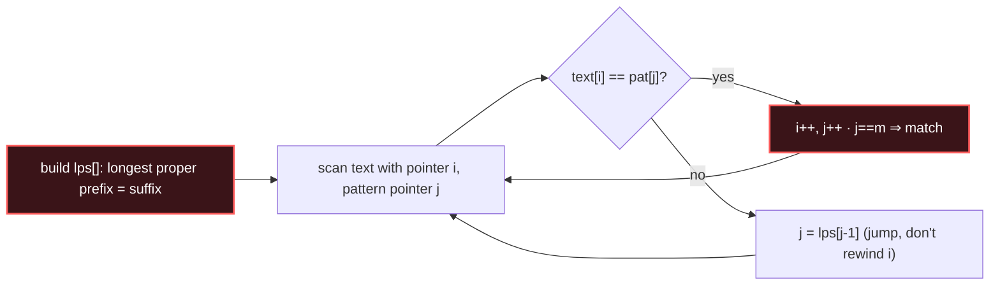

# String Matching

## Signal keywords
<span class="chip">pattern in text</span> <span class="chip">needle in haystack</span> <span class="chip">repeated substring</span> <span class="chip">prefix = suffix</span> <span class="chip">KMP / Rabin-Karp</span>

## When to use / NOT use

<div class="usenot" markdown>
<div class="wbox use" markdown>

**Use** to locate a pattern in a text in **O(n+m)** — KMP builds a failure table so the text pointer never moves backward; Rabin-Karp rolls a hash across windows.

</div>
<div class="wbox avoid" markdown>

**Not** for approximate / fuzzy matching or multi-pattern search (→ Aho-Corasick, edit distance) — this is exact single-pattern matching.

</div>
</div>

## Diagram


## Mnemonic
!!! tip "Mnemonic"
    **Precompute prefix jumps; never backtrack.**

## Template
=== "Java"
    ```java
    int[] buildLps(String p) {          // lps[i] = longest prefix==suffix of p[0..i]
        int[] lps = new int[p.length()];
        int len = 0;
        for (int i = 1; i < p.length(); ) {
            if (p.charAt(i) == p.charAt(len)) lps[i++] = ++len;
            else if (len > 0) len = lps[len - 1];   // fall back
            else lps[i++] = 0;
        }
        return lps;
    }
    int kmp(String t, String p) {
        int[] lps = buildLps(p);
        for (int i = 0, j = 0; i < t.length(); ) {
            if (t.charAt(i) == p.charAt(j)) { i++; j++; if (j == p.length()) return i - j; }
            else if (j > 0) j = lps[j - 1];
            else i++;
        }
        return -1;
    }
    ```
=== "Python"
    ```python
    def build_lps(p):
        lps = [0] * len(p); length = 0; i = 1
        while i < len(p):
            if p[i] == p[length]: length += 1; lps[i] = length; i += 1
            elif length: length = lps[length - 1]   # fall back
            else: lps[i] = 0; i += 1
        return lps
    def kmp(t, p):
        lps = build_lps(p); i = j = 0
        while i < len(t):
            if t[i] == p[j]:
                i += 1; j += 1
                if j == len(p): return i - j
            elif j: j = lps[j - 1]
            else: i += 1
        return -1
    ```
=== "C++"
    ```cpp
    vector<int> buildLps(const string& p) {
        vector<int> lps(p.size()); int len = 0;
        for (int i = 1; i < p.size(); ) {
            if (p[i] == p[len]) lps[i++] = ++len;
            else if (len) len = lps[len - 1];
            else lps[i++] = 0;
        }
        return lps;
    }
    ```

## Complexity
**Time O(n + m)** — build the table in O(m), scan the text in O(n). **Space O(m)** for the `lps` array.

## Pitfalls

- On mismatch, fall back to `lps[len-1]`, not to 0 — that's what preserves linearity.
- Off-by-one when returning the match index (`i - j`).
- Rabin-Karp must **verify** a hash hit character-by-character (collisions) and use modular arithmetic to avoid overflow.
- Building `lps` compares within the pattern only, never the text.

## Canonical problems
1. [Find the Index of the First Occurrence in a String](https://leetcode.com/problems/find-the-index-of-the-first-occurrence-in-a-string/) <span class="diff-e">Easy</span>
2. [Repeated Substring Pattern](https://leetcode.com/problems/repeated-substring-pattern/) <span class="diff-e">Easy</span>
3. [Repeated String Match](https://leetcode.com/problems/repeated-string-match/) <span class="diff-m">Medium</span>
4. [Shortest Palindrome](https://leetcode.com/problems/shortest-palindrome/) <span class="diff-h">Hard</span>
5. [Longest Happy Prefix](https://leetcode.com/problems/longest-happy-prefix/) <span class="diff-h">Hard</span>
