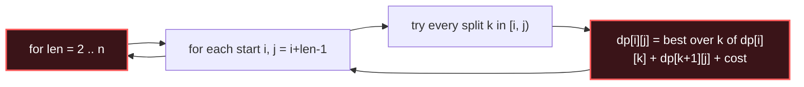

# Interval DP

## Signal keywords
<span class="chip">range [i, j] from splits</span> <span class="chip">burst balloons</span> <span class="chip">merge stones</span> <span class="chip">cut a stick</span> <span class="chip">matrix chain</span>

## When to use / NOT use

<div class="usenot" markdown>
<div class="wbox use" markdown>

**Use** when the answer for an interval `[i, j]` is built from a **split point k** inside it (`dp[i][k] + dp[k+1][j] + cost`). Fill by **increasing interval length**.

</div>
<div class="wbox avoid" markdown>

**Not** for linear/1-D DP where state only depends on a prefix (→ standard DP), or when there's no "combine two sub-ranges" structure.

</div>
</div>

## Diagram


## Mnemonic
!!! tip "Mnemonic"
    **Solve inner intervals; merge outward.**

## Template
=== "Java"
    ```java
    int intervalDP(int[] a) {
        int n = a.length;
        int[][] dp = new int[n][n];                 // dp[i][j] = best on [i, j]
        for (int len = 2; len <= n; len++)          // grow interval length
            for (int i = 0; i + len - 1 < n; i++) {
                int j = i + len - 1;
                dp[i][j] = Integer.MAX_VALUE;
                for (int k = i; k < j; k++)         // split point
                    dp[i][j] = Math.min(dp[i][j],
                        dp[i][k] + dp[k + 1][j] + cost(a, i, j, k));
            }
        return dp[0][n - 1];
    }
    ```
=== "Python"
    ```python
    def interval_dp(a):
        n = len(a)
        dp = [[0] * n for _ in range(n)]            # dp[i][j] = best on [i, j]
        for length in range(2, n + 1):              # grow length
            for i in range(0, n - length + 1):
                j = i + length - 1
                dp[i][j] = min(dp[i][k] + dp[k + 1][j] + cost(a, i, j, k)
                               for k in range(i, j))
        return dp[0][n - 1]
    ```
=== "C++"
    ```cpp
    int intervalDP(vector<int>& a) {
        int n = a.size();
        vector<vector<int>> dp(n, vector<int>(n, 0));
        for (int len = 2; len <= n; len++)
            for (int i = 0; i + len - 1 < n; i++) {
                int j = i + len - 1; dp[i][j] = INT_MAX;
                for (int k = i; k < j; k++)
                    dp[i][j] = min(dp[i][j], dp[i][k] + dp[k+1][j] + cost(a, i, j, k));
            }
        return dp[0][n - 1];
    }
    ```

## Complexity
**Time O(n³)** — O(n²) intervals × O(n) split points. **Space O(n²)** for the table.

## Pitfalls

- Iterate by **length**, not raw `i, j` — sub-intervals must be solved first.
- Base case is length 1 (often 0); initialize the rest carefully (MIN vs MAX).
- The `k` range is `[i, j)`; off-by-one here is the classic bug.
- Burst Balloons reverses the intuition: think of the **last** balloon popped in `[i, j]`.

## Canonical problems
1. [Longest Palindromic Subsequence](https://leetcode.com/problems/longest-palindromic-subsequence/) <span class="diff-m">Medium</span>
2. [Stone Game](https://leetcode.com/problems/stone-game/) <span class="diff-m">Medium</span>
3. [Minimum Cost to Cut a Stick](https://leetcode.com/problems/minimum-cost-to-cut-a-stick/) <span class="diff-h">Hard</span>
4. [Burst Balloons](https://leetcode.com/problems/burst-balloons/) <span class="diff-h">Hard</span>
5. [Palindrome Partitioning II](https://leetcode.com/problems/palindrome-partitioning-ii/) <span class="diff-h">Hard</span>
