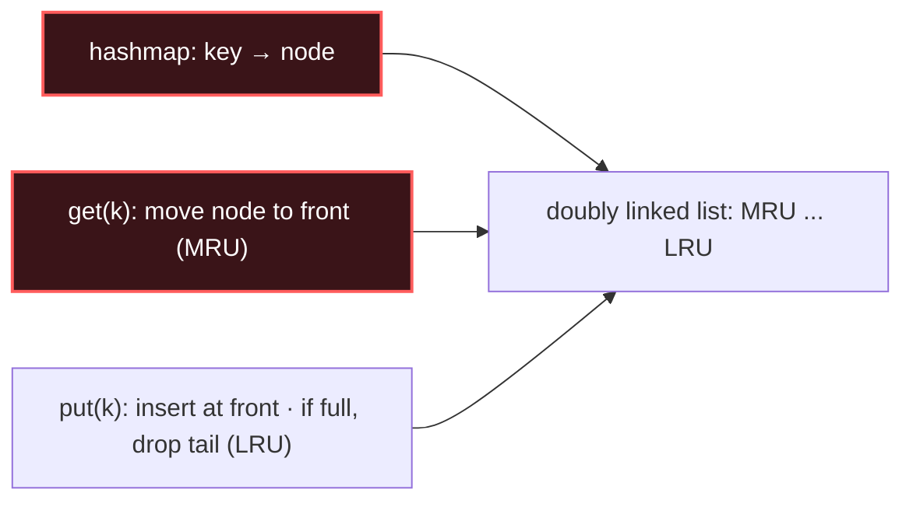

# LRU / LFU Cache Design

## Signal keywords
<span class="chip">design a cache</span> <span class="chip">O(1) get / put</span> <span class="chip">least recently used</span> <span class="chip">least frequently used</span> <span class="chip">fixed capacity</span>

## When to use / NOT use

<div class="usenot" markdown>
<div class="wbox use" markdown>

**Use** to get **O(1)** `get`/`put` with eviction: a **hashmap** (key → node) for lookup plus a **doubly linked list** for recency order. LFU adds per-frequency buckets.

</div>
<div class="wbox avoid" markdown>

**Not** when there's no eviction / ordering requirement — a plain `HashMap` already does O(1) lookups.

</div>
</div>

## Diagram


## Mnemonic
!!! tip "Mnemonic"
    **Hashmap plus linked list equals O(1).**

## Template
=== "Java"
    ```java
    class LRUCache extends LinkedHashMap<Integer, Integer> {
        private final int cap;
        LRUCache(int cap) {
            super(cap, 0.75f, true);            // true = access-order
            this.cap = cap;
        }
        public int get(int key) { return super.getOrDefault(key, -1); }
        public void put(int key, int value) { super.put(key, value); }
        protected boolean removeEldestEntry(Map.Entry<Integer, Integer> e) {
            return size() > cap;                // evict LRU when over capacity
        }
    }
    ```
=== "Python"
    ```python
    from collections import OrderedDict
    class LRUCache:
        def __init__(self, cap):
            self.cache = OrderedDict(); self.cap = cap
        def get(self, key):
            if key not in self.cache: return -1
            self.cache.move_to_end(key)          # mark most-recent
            return self.cache[key]
        def put(self, key, value):
            if key in self.cache: self.cache.move_to_end(key)
            self.cache[key] = value
            if len(self.cache) > self.cap:
                self.cache.popitem(last=False)   # evict LRU
    ```
=== "C++"
    ```cpp
    class LRUCache {
        int cap; list<pair<int,int>> dll;               // front = MRU
        unordered_map<int, list<pair<int,int>>::iterator> mp;
    public:
        LRUCache(int c) : cap(c) {}
        int get(int key) {
            if (!mp.count(key)) return -1;
            dll.splice(dll.begin(), dll, mp[key]);       // move to front
            return mp[key]->second;
        }
        void put(int key, int val) {
            if (mp.count(key)) dll.erase(mp[key]);
            dll.push_front({key, val}); mp[key] = dll.begin();
            if (dll.size() > cap) { mp.erase(dll.back().first); dll.pop_back(); }
        }
    };
    ```

## Complexity
**Time O(1)** for `get` and `put` (hashmap lookup + constant list splice). **Space O(capacity)**.

## Pitfalls

- LRU with `LinkedHashMap` needs the **access-order** flag (`true`), else it tracks insertion order.
- A hand-rolled doubly linked list needs **dummy head/tail** to avoid null checks.
- Update recency on **every** `get`, not just `put`.
- LFU is harder: keep a map of frequency → ordered list and track the current minimum frequency for O(1) eviction.

## Canonical problems
1. [Design HashMap](https://leetcode.com/problems/design-hashmap/) <span class="diff-e">Easy</span>
2. [LRU Cache](https://leetcode.com/problems/lru-cache/) <span class="diff-m">Medium</span>
3. [Design Browser History](https://leetcode.com/problems/design-browser-history/) <span class="diff-m">Medium</span>
4. [LFU Cache](https://leetcode.com/problems/lfu-cache/) <span class="diff-h">Hard</span>
5. [All O`one Data Structure](https://leetcode.com/problems/all-oone-data-structure/) <span class="diff-h">Hard</span>
