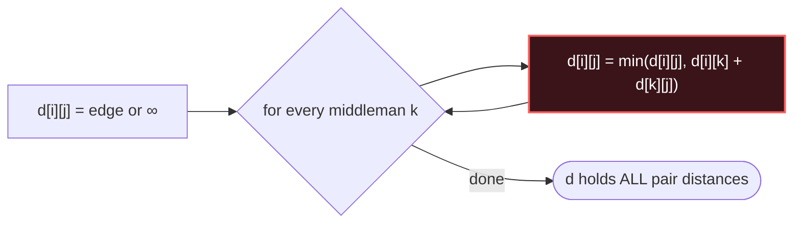

# Floyd-Warshall

## Signal keywords
<span class="chip">every pair</span> <span class="chip">small dense graph</span> <span class="chip">via any intermediate</span> <span class="chip">transitive closure</span> <span class="chip">all-pairs reachability</span>

## When to use / NOT use

<div class="usenot" markdown>
<div class="wbox use" markdown>

**Use** when you need distances (or reachability) between **all pairs** and n is small (≤ ~400): one triple loop relaxes every pair through every intermediate.

</div>
<div class="wbox avoid" markdown>

**Not** for a single source (→ Dijkstra / Bellman-Ford) or big sparse graphs — O(V³) drowns past a few hundred nodes.

</div>
</div>

## Diagram


## Mnemonic
!!! tip "Mnemonic"
    **Try every k as the middleman.**

## Template
=== "Java"
    ```java
    long[][] floydWarshall(int n, int[][] edges) {
        long INF = (long) 1e15;
        long[][] d = new long[n][n];
        for (long[] row : d) Arrays.fill(row, INF);
        for (int i = 0; i < n; i++) d[i][i] = 0;
        for (int[] e : edges)
            d[e[0]][e[1]] = Math.min(d[e[0]][e[1]], e[2]);  // keep cheapest parallel edge
        for (int k = 0; k < n; k++)                 // middleman loop OUTERMOST
            for (int i = 0; i < n; i++)
                for (int j = 0; j < n; j++)
                    if (d[i][k] + d[k][j] < d[i][j])
                        d[i][j] = d[i][k] + d[k][j];  // relax i -> k -> j
        return d;
    }
    ```
=== "Python"
    ```python
    def floyd_warshall(n, edges):
        INF = float("inf")
        d = [[INF] * n for _ in range(n)]
        for i in range(n): d[i][i] = 0
        for u, v, w in edges: d[u][v] = min(d[u][v], w)
        for k in range(n):                    # middleman outermost
            for i in range(n):
                for j in range(n):
                    if d[i][k] + d[k][j] < d[i][j]:
                        d[i][j] = d[i][k] + d[k][j]
        return d
    ```
=== "C++"
    ```cpp
    vector<vector<long long>> floydWarshall(int n, vector<array<int,3>>& edges) {
        const long long INF = 1e15;
        vector<vector<long long>> d(n, vector<long long>(n, INF));
        for (int i = 0; i < n; i++) d[i][i] = 0;
        for (auto& [u, v, w] : edges) d[u][v] = min(d[u][v], (long long) w);
        for (int k = 0; k < n; k++)           // middleman outermost
            for (int i = 0; i < n; i++)
                for (int j = 0; j < n; j++)
                    d[i][j] = min(d[i][j], d[i][k] + d[k][j]);
        return d;
    }
    ```

## Complexity
**Time O(V³)** — three nested loops over vertices, edges irrelevant. **Space O(V²)** for the distance matrix. For reachability only, store booleans (transitive closure).

## Pitfalls

- Putting the middleman loop `k` inside — it must be the **outermost** loop.
- Overflow on `INF + weight` — use `long`/`1e15`, not `Integer.MAX_VALUE`.
- Forgetting `d[i][i] = 0`, or overwriting a cheaper parallel edge on input.
- Using it on n in the thousands — that's V³ ≈ 10⁹⁺ operations; switch to per-source Dijkstra.

## Canonical problems
1. [Network Delay Time](https://leetcode.com/problems/network-delay-time/) <span class="diff-m">Medium</span>
2. [Find the City With the Smallest Number of Neighbors at a Threshold Distance](https://leetcode.com/problems/find-the-city-with-the-smallest-number-of-neighbors-at-a-threshold-distance/) <span class="diff-m">Medium</span>
3. [Course Schedule IV](https://leetcode.com/problems/course-schedule-iv/) <span class="diff-m">Medium</span>
4. [Evaluate Division](https://leetcode.com/problems/evaluate-division/) <span class="diff-m">Medium</span>
5. [Minimum Cost to Convert String I](https://leetcode.com/problems/minimum-cost-to-convert-string-i/) <span class="diff-m">Medium</span>
