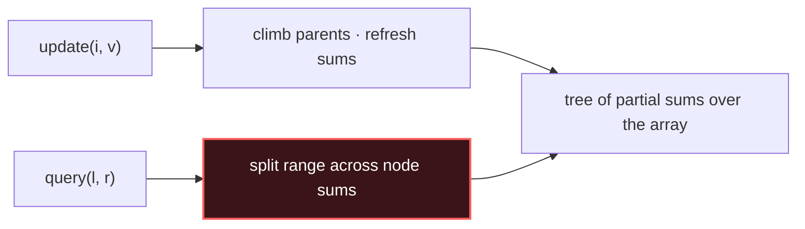

# Range Queries (Segment Tree / BIT)

## Signal keywords
<span class="chip">range sum + updates</span> <span class="chip">count smaller so far</span> <span class="chip">inversions</span> <span class="chip">reverse pairs</span> <span class="chip">mutable prefix totals</span>

## When to use / NOT use

<div class="usenot" markdown>
<div class="wbox use" markdown>

**Use** when both **updates and range queries** must stay fast — a static prefix array dies on writes; these keep every operation O(log n).

</div>
<div class="wbox avoid" markdown>

**Not** when the array never changes (→ plain Prefix Sum) or you only query the whole array (keep one running total).

</div>
</div>

## Diagram


## Mnemonic
!!! tip "Mnemonic"
    **Update climbs; query splits the range.**

## The two structures

### 1. Segment Tree — general range queries (sum/min/max, iterative)
=== "Java"
    ```java
    class SegTree {                       // range sum, point assign
        int n; long[] t;
        SegTree(int[] a) {
            n = a.length; t = new long[2 * n];
            for (int i = 0; i < n; i++) t[n + i] = a[i];
            for (int i = n - 1; i > 0; i--) t[i] = t[2*i] + t[2*i + 1];
        }
        void update(int i, int v) {       // climb parents
            for (t[i += n] = v; i > 1; i >>= 1) t[i >> 1] = t[i] + t[i ^ 1];
        }
        long query(int l, int r) {        // sum of [l, r) — split range
            long s = 0;
            for (l += n, r += n; l < r; l >>= 1, r >>= 1) {
                if ((l & 1) == 1) s += t[l++];
                if ((r & 1) == 1) s += t[--r];
            }
            return s;
        }
    }
    ```
=== "Python"
    ```python
    class SegTree:                        # range sum, point assign
        def __init__(self, a):
            self.n = n = len(a)
            self.t = t = [0] * n + list(a)
            for i in range(n - 1, 0, -1): t[i] = t[2*i] + t[2*i+1]
        def update(self, i, v):           # climb parents
            i += self.n; self.t[i] = v
            while i > 1:
                i //= 2; self.t[i] = self.t[2*i] + self.t[2*i+1]
        def query(self, l, r):            # sum of [l, r) — split range
            l += self.n; r += self.n; s = 0
            while l < r:
                if l & 1: s += self.t[l]; l += 1
                if r & 1: r -= 1; s += self.t[r]
                l //= 2; r //= 2
            return s
    ```
=== "C++"
    ```cpp
    struct SegTree {                      // range sum, point assign
        int n; vector<long long> t;
        SegTree(vector<int>& a) : n(a.size()), t(2 * a.size()) {
            for (int i = 0; i < n; i++) t[n + i] = a[i];
            for (int i = n - 1; i > 0; i--) t[i] = t[2*i] + t[2*i+1];
        }
        void update(int i, int v) {
            for (t[i += n] = v; i > 1; i >>= 1) t[i >> 1] = t[i] + t[i ^ 1];
        }
        long long query(int l, int r) {   // [l, r)
            long long s = 0;
            for (l += n, r += n; l < r; l >>= 1, r >>= 1) {
                if (l & 1) s += t[l++];
                if (r & 1) s += t[--r];
            }
            return s;
        }
    };
    ```

### 2. Fenwick / BIT — prefix sums with updates (shorter, sums only)
```java
class BIT {                              // 1-based indices
    long[] t; int n;
    BIT(int n) { this.n = n; t = new long[n + 1]; }
    void add(int i, long v) {            // climb by lowbit
        for (; i <= n; i += i & -i) t[i] += v;
    }
    long prefix(int i) {                 // sum of [1..i], descend by lowbit
        long s = 0;
        for (; i > 0; i -= i & -i) s += t[i];
        return s;
    }                                    // range [l..r] = prefix(r) - prefix(l-1)
}
```
_Counting "smaller than x so far": coordinate-compress values, BIT over counts, prefix(x-1) per element._

## Complexity
**Time O(log n)** per update or query for both structures; build O(n). **Space O(n)** — the segment tree uses 2n slots, the BIT n+1. Prefer the BIT when you only need prefix sums; the segment tree generalizes to min/max/gcd.

## Pitfalls

- Mixing 0-based array indices with the BIT's **1-based** internals.
- Segment-tree `query(l, r)` here is half-open `[l, r)` — off-by-one on the right edge.
- Forgetting **coordinate compression** before counting with a BIT over values.
- Rebuilding the whole tree per update — the entire point is the O(log n) climb.

## Canonical problems
1. [Count Number of Teams](https://leetcode.com/problems/count-number-of-teams/) <span class="diff-m">Medium</span>
2. [Range Sum Query - Mutable](https://leetcode.com/problems/range-sum-query-mutable/) <span class="diff-m">Medium</span>
3. [Count of Smaller Numbers After Self](https://leetcode.com/problems/count-of-smaller-numbers-after-self/) <span class="diff-h">Hard</span>
4. [Reverse Pairs](https://leetcode.com/problems/reverse-pairs/) <span class="diff-h">Hard</span>
5. [Falling Squares](https://leetcode.com/problems/falling-squares/) <span class="diff-h">Hard</span>
