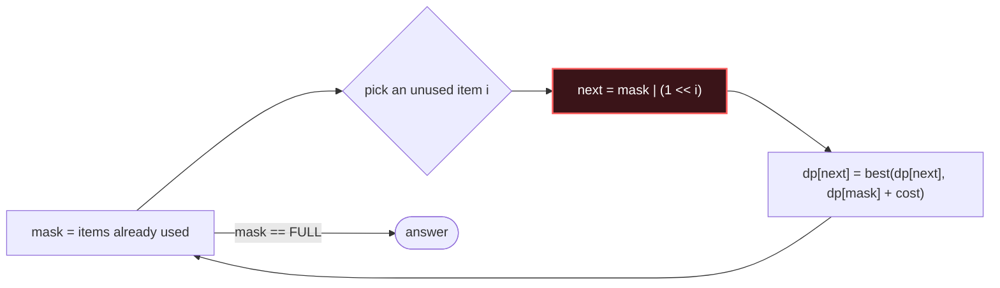

# Bitmask DP

## Signal keywords
<span class="chip">n ≤ 20</span> <span class="chip">assign everyone</span> <span class="chip">visit-all tour</span> <span class="chip">cover all items</span> <span class="chip">subsets as states</span>

## When to use / NOT use

<div class="usenot" markdown>
<div class="wbox use" markdown>

**Use** when the state is "**which subset** have I used" and n ≤ ~20 — encode the subset as bits, DP over 2ⁿ masks instead of n! orderings.

</div>
<div class="wbox avoid" markdown>

**Not** when n is above ~22 (2ⁿ explodes) or the order inside the subset never matters (→ plain DP / Greedy).

</div>
</div>

## Diagram


## Mnemonic
!!! tip "Mnemonic"
    **The mask is the visited set.**

## Template
=== "Java"
    ```java
    int tsp(int[][] cost) {                       // n ≤ 20
        int n = cost.length, FULL = 1 << n, INF = 1 << 28;
        int[][] dp = new int[FULL][n];
        for (int[] r : dp) Arrays.fill(r, INF);
        dp[1][0] = 0;                             // start: only node 0 visited
        for (int mask = 1; mask < FULL; mask++)
            for (int last = 0; last < n; last++) {
                if (dp[mask][last] == INF || (mask >> last & 1) == 0) continue;
                for (int nxt = 0; nxt < n; nxt++) {
                    if ((mask >> nxt & 1) == 1) continue;   // already visited
                    int m2 = mask | 1 << nxt;               // extend the set
                    dp[m2][nxt] = Math.min(dp[m2][nxt], dp[mask][last] + cost[last][nxt]);
                }
            }
        int best = INF;
        for (int last = 0; last < n; last++) best = Math.min(best, dp[FULL - 1][last]);
        return best;
    }
    ```
=== "Python"
    ```python
    def tsp(cost):                           # n <= 20
        n = len(cost); FULL = 1 << n; INF = float("inf")
        dp = [[INF] * n for _ in range(FULL)]
        dp[1][0] = 0                         # start at node 0
        for mask in range(1, FULL):
            for last in range(n):
                if dp[mask][last] == INF or not mask >> last & 1: continue
                for nxt in range(n):
                    if mask >> nxt & 1: continue
                    m2 = mask | 1 << nxt     # extend the visited set
                    dp[m2][nxt] = min(dp[m2][nxt], dp[mask][last] + cost[last][nxt])
        return min(dp[FULL - 1])
    ```
=== "C++"
    ```cpp
    int tsp(vector<vector<int>>& cost) {          // n <= 20
        int n = cost.size(), FULL = 1 << n, INF = 1 << 28;
        vector<vector<int>> dp(FULL, vector<int>(n, INF));
        dp[1][0] = 0;
        for (int mask = 1; mask < FULL; mask++)
            for (int last = 0; last < n; last++) {
                if (dp[mask][last] == INF || !(mask >> last & 1)) continue;
                for (int nxt = 0; nxt < n; nxt++) {
                    if (mask >> nxt & 1) continue;
                    int m2 = mask | 1 << nxt;     // extend the set
                    dp[m2][nxt] = min(dp[m2][nxt], dp[mask][last] + cost[last][nxt]);
                }
            }
        return *min_element(dp[FULL - 1].begin(), dp[FULL - 1].end());
    }
    ```

## Complexity
**Time O(2ⁿ · n²)** — every mask × last × next. **Space O(2ⁿ · n)** for the table. Drop the `last` dimension (→ O(2ⁿ)) when transitions don't need it (cover/assignment problems).

## Pitfalls

- Reaching for it at n = 30 — 2³⁰ states is a gigabyte, the signal is **n ≤ 20**.
- Testing bits with `mask >> i & 1 == 0` — precedence trap; parenthesize `(mask >> i & 1)`.
- Iterating masks out of order — a mask must be processed **after** all its submasks.
- Forgetting memoization in the recursive form — that's just brute force with extra steps.

## Canonical problems
1. [Beautiful Arrangement](https://leetcode.com/problems/beautiful-arrangement/) <span class="diff-m">Medium</span>
2. [Partition to K Equal Sum Subsets](https://leetcode.com/problems/partition-to-k-equal-sum-subsets/) <span class="diff-m">Medium</span>
3. [Shortest Path Visiting All Nodes](https://leetcode.com/problems/shortest-path-visiting-all-nodes/) <span class="diff-h">Hard</span>
4. [Smallest Sufficient Team](https://leetcode.com/problems/smallest-sufficient-team/) <span class="diff-h">Hard</span>
5. [Parallel Courses II](https://leetcode.com/problems/parallel-courses-ii/) <span class="diff-h">Hard</span>
