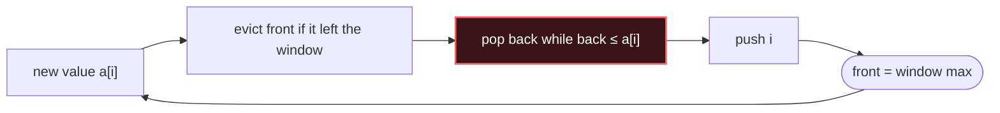

# Monotonic Deque

## Signal keywords
<span class="chip">max of each window</span> <span class="chip">moving best candidate</span> <span class="chip">sum ≥ k shortest</span> <span class="chip">windowed DP max</span> <span class="chip">size-k range</span>

## When to use / NOT use

<div class="usenot" markdown>
<div class="wbox use" markdown>

**Use** for the running **max/min of a sliding range**: keep indices whose values stay sorted in the deque — the front is always the window's champion, each index enters and leaves once.

</div>
<div class="wbox avoid" markdown>

**Not** for "next greater element" one-shot scans (→ Monotonic Stack) or when the window never slides (one pass max). A heap works too but costs O(n log n) and lazy deletes.

</div>
</div>

## Diagram


## Mnemonic
!!! tip "Mnemonic"
    **Front holds champion; pop losers behind.**

## Template
=== "Java"
    ```java
    int[] maxSlidingWindow(int[] a, int k) {
        Deque<Integer> dq = new ArrayDeque<>();   // indices, values decreasing
        int[] out = new int[a.length - k + 1];
        for (int i = 0; i < a.length; i++) {
            if (!dq.isEmpty() && dq.peekFirst() <= i - k)
                dq.pollFirst();                   // front left the window
            while (!dq.isEmpty() && a[dq.peekLast()] <= a[i])
                dq.pollLast();                    // pop losers behind
            dq.offerLast(i);
            if (i >= k - 1) out[i - k + 1] = a[dq.peekFirst()];  // front = champion
        }
        return out;
    }
    ```
=== "Python"
    ```python
    from collections import deque
    def max_sliding_window(a, k):
        dq, out = deque(), []            # indices, values decreasing
        for i, x in enumerate(a):
            if dq and dq[0] <= i - k:
                dq.popleft()             # front left the window
            while dq and a[dq[-1]] <= x:
                dq.pop()                 # pop losers behind
            dq.append(i)
            if i >= k - 1:
                out.append(a[dq[0]])     # front = champion
        return out
    ```
=== "C++"
    ```cpp
    vector<int> maxSlidingWindow(vector<int>& a, int k) {
        deque<int> dq;                        // indices, values decreasing
        vector<int> out;
        for (int i = 0; i < (int) a.size(); i++) {
            if (!dq.empty() && dq.front() <= i - k) dq.pop_front();
            while (!dq.empty() && a[dq.back()] <= a[i]) dq.pop_back();
            dq.push_back(i);
            if (i >= k - 1) out.push_back(a[dq.front()]);   // front = champion
        }
        return out;
    }
    ```

## Complexity
**Time O(n)** — every index is pushed once and popped at most once. **Space O(k)** — the deque never outgrows the window.

## Pitfalls

- Storing **values** instead of **indices** — you can't tell when the front expires.
- Evicting the front with `<` instead of `<=` (or vice versa) — off-by-one on window entry.
- Wrong monotonic direction: decreasing deque for max, increasing for min.
- Reaching for a heap — it works, but O(n log n) plus stale-entry cleanup; the deque is strictly better here.

## Canonical problems
1. [Jump Game VI](https://leetcode.com/problems/jump-game-vi/) <span class="diff-m">Medium</span>
2. [Longest Continuous Subarray With Absolute Diff Less Than or Equal to Limit](https://leetcode.com/problems/longest-continuous-subarray-with-absolute-diff-less-than-or-equal-to-limit/) <span class="diff-m">Medium</span>
3. [Sliding Window Maximum](https://leetcode.com/problems/sliding-window-maximum/) <span class="diff-h">Hard</span>
4. [Shortest Subarray with Sum at Least K](https://leetcode.com/problems/shortest-subarray-with-sum-at-least-k/) <span class="diff-h">Hard</span>
5. [Constrained Subsequence Sum](https://leetcode.com/problems/constrained-subsequence-sum/) <span class="diff-h">Hard</span>
